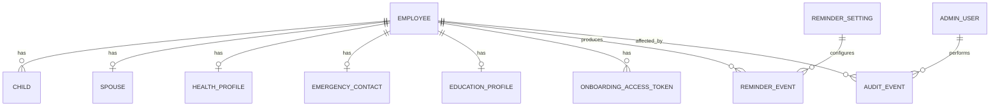

# Data Model: Sistema de Onboarding Du Ramo Locacoes

## 1. Purpose

This document refines the database design for the onboarding system. It complements:

- `docs/prd.md`
- `docs/front-end-spec.md`
- `docs/fullstack-architecture.md`

The goal is to define the domain entities, relationships, constraints, indexes, privacy notes, and migration guidance before implementation starts.

## 2. Database Choice

Recommended database: PostgreSQL.

Rationale:

- The domain is relational and structured.
- Employee data has clear one-to-one and one-to-many relationships.
- PostgreSQL supports strong constraints, indexes, transactional writes and reliable backups.
- It fits VPS/Coolify deployment well.

## 3. Domain Model Overview



## 4. Entities

### 4.1 employees

Stores the core onboarding record.

Columns:

- `id UUID PRIMARY KEY`
- `full_name TEXT NOT NULL`
- `birth_date DATE`
- `phone TEXT`
- `email TEXT`
- `instagram TEXT`
- `residential_address TEXT`
- `status onboarding_status NOT NULL DEFAULT 'cadastro_iniciado'`
- `completion_percent INTEGER NOT NULL DEFAULT 0`
- `submitted_at TIMESTAMPTZ`
- `reviewed_at TIMESTAMPTZ`
- `created_at TIMESTAMPTZ NOT NULL DEFAULT now()`
- `updated_at TIMESTAMPTZ NOT NULL DEFAULT now()`
- `deleted_at TIMESTAMPTZ`

Notes:

- Use `deleted_at` instead of physical delete if the business needs historical traceability.
- `birth_date` may be nullable during preliminary creation but should be required before final submit.

### 4.2 onboarding_access_tokens

Stores token metadata for employee access without login.

Columns:

- `id UUID PRIMARY KEY`
- `employee_id UUID NOT NULL REFERENCES employees(id) ON DELETE CASCADE`
- `token_hash TEXT NOT NULL UNIQUE`
- `expires_at TIMESTAMPTZ NOT NULL`
- `used_at TIMESTAMPTZ`
- `revoked_at TIMESTAMPTZ`
- `created_by_admin_id UUID REFERENCES admin_users(id)`
- `created_at TIMESTAMPTZ NOT NULL DEFAULT now()`

Constraints:

- Raw token must never be stored.
- Token is valid only when `used_at IS NULL`, `revoked_at IS NULL`, and `expires_at > now()`.

### 4.3 children

Stores employee children for family recognition and birthday reminders.

Columns:

- `id UUID PRIMARY KEY`
- `employee_id UUID NOT NULL REFERENCES employees(id) ON DELETE CASCADE`
- `name TEXT NOT NULL`
- `gender TEXT`
- `birth_date DATE NOT NULL`
- `created_at TIMESTAMPTZ NOT NULL DEFAULT now()`
- `updated_at TIMESTAMPTZ NOT NULL DEFAULT now()`

Notes:

- No hard limit is required for number of children.
- `gender` should be stored as flexible text or enum only after business wording is confirmed.

### 4.4 spouses

Stores spouse/partner data when employee is married or in stable union.

Columns:

- `id UUID PRIMARY KEY`
- `employee_id UUID NOT NULL UNIQUE REFERENCES employees(id) ON DELETE CASCADE`
- `name TEXT NOT NULL`
- `phone TEXT`
- `wedding_anniversary DATE`
- `created_at TIMESTAMPTZ NOT NULL DEFAULT now()`
- `updated_at TIMESTAMPTZ NOT NULL DEFAULT now()`

Notes:

- One spouse record per employee in MVP.

### 4.5 health_profiles

Stores sensitive health data.

Columns:

- `id UUID PRIMARY KEY`
- `employee_id UUID NOT NULL UNIQUE REFERENCES employees(id) ON DELETE CASCADE`
- `continuous_medication TEXT`
- `allergies TEXT`
- `relevant_condition TEXT`
- `work_restriction TEXT`
- `additional_notes TEXT`
- `consent_accepted_at TIMESTAMPTZ`
- `created_at TIMESTAMPTZ NOT NULL DEFAULT now()`
- `updated_at TIMESTAMPTZ NOT NULL DEFAULT now()`

Security notes:

- Treat all fields in this table as sensitive.
- Do not include this table in default exports.
- Avoid logging any values from this table.
- Require consent before final submission if any health data is stored.

### 4.6 emergency_contacts

Stores emergency contact data.

Columns:

- `id UUID PRIMARY KEY`
- `employee_id UUID NOT NULL UNIQUE REFERENCES employees(id) ON DELETE CASCADE`
- `name TEXT NOT NULL`
- `phone TEXT NOT NULL`
- `address TEXT`
- `created_at TIMESTAMPTZ NOT NULL DEFAULT now()`
- `updated_at TIMESTAMPTZ NOT NULL DEFAULT now()`

### 4.7 education_profiles

Stores academic schedule data.

Columns:

- `id UUID PRIMARY KEY`
- `employee_id UUID NOT NULL UNIQUE REFERENCES employees(id) ON DELETE CASCADE`
- `institution TEXT`
- `course_name TEXT`
- `course_schedule TEXT`
- `expected_end_date DATE`
- `created_at TIMESTAMPTZ NOT NULL DEFAULT now()`
- `updated_at TIMESTAMPTZ NOT NULL DEFAULT now()`

Notes:

- The schedule field should remain text in MVP because course schedules may be irregular.

### 4.8 admin_users

Stores internal users.

Columns:

- `id UUID PRIMARY KEY`
- `name TEXT NOT NULL`
- `email TEXT NOT NULL UNIQUE`
- `password_hash TEXT NOT NULL`
- `role admin_role NOT NULL DEFAULT 'rh'`
- `is_active BOOLEAN NOT NULL DEFAULT true`
- `created_at TIMESTAMPTZ NOT NULL DEFAULT now()`
- `updated_at TIMESTAMPTZ NOT NULL DEFAULT now()`

Roles:

- `admin`
- `rh`
- `gestor`

### 4.9 reminder_settings

Stores reminder configuration.

Columns:

- `id UUID PRIMARY KEY`
- `name TEXT NOT NULL DEFAULT 'default'`
- `enabled BOOLEAN NOT NULL DEFAULT true`
- `days_before INTEGER[] NOT NULL DEFAULT ARRAY[7, 0]`
- `recipient_emails TEXT[] NOT NULL`
- `include_employee_birthdays BOOLEAN NOT NULL DEFAULT true`
- `include_child_birthdays BOOLEAN NOT NULL DEFAULT true`
- `include_wedding_anniversaries BOOLEAN NOT NULL DEFAULT true`
- `created_at TIMESTAMPTZ NOT NULL DEFAULT now()`
- `updated_at TIMESTAMPTZ NOT NULL DEFAULT now()`

### 4.10 reminder_events

Stores generated or sent reminder attempts.

Columns:

- `id UUID PRIMARY KEY`
- `employee_id UUID NOT NULL REFERENCES employees(id) ON DELETE CASCADE`
- `setting_id UUID REFERENCES reminder_settings(id)`
- `event_type reminder_event_type NOT NULL`
- `event_date DATE NOT NULL`
- `related_name TEXT`
- `recipient_emails TEXT[] NOT NULL`
- `status reminder_status NOT NULL DEFAULT 'pending'`
- `sent_at TIMESTAMPTZ`
- `error_message TEXT`
- `created_at TIMESTAMPTZ NOT NULL DEFAULT now()`

Event types:

- `employee_birthday`
- `child_birthday`
- `wedding_anniversary`

Statuses:

- `pending`
- `sent`
- `failed`
- `skipped`

### 4.11 audit_events

Stores basic audit history for sensitive operational actions.

Columns:

- `id UUID PRIMARY KEY`
- `admin_user_id UUID REFERENCES admin_users(id)`
- `employee_id UUID REFERENCES employees(id)`
- `action TEXT NOT NULL`
- `metadata JSONB`
- `created_at TIMESTAMPTZ NOT NULL DEFAULT now()`

Recommended actions:

- `employee.created`
- `employee.updated`
- `token.generated`
- `token.revoked`
- `onboarding.submitted`
- `onboarding.reopened`
- `onboarding.reviewed`
- `export.generated`
- `health.viewed` if the business wants stronger health-data audit later.

## 5. Enums

```sql
CREATE TYPE onboarding_status AS ENUM (
  'cadastro_iniciado',
  'pendente_informacoes',
  'cadastro_completo',
  'revisado'
);

CREATE TYPE admin_role AS ENUM (
  'admin',
  'rh',
  'gestor'
);

CREATE TYPE reminder_event_type AS ENUM (
  'employee_birthday',
  'child_birthday',
  'wedding_anniversary'
);

CREATE TYPE reminder_status AS ENUM (
  'pending',
  'sent',
  'failed',
  'skipped'
);
```

## 6. Index Strategy

Create indexes based on MVP access patterns:

```sql
CREATE INDEX idx_employees_status ON employees(status);
CREATE INDEX idx_employees_full_name ON employees(full_name);
CREATE INDEX idx_employees_birth_date ON employees(birth_date);
CREATE INDEX idx_employees_deleted_at ON employees(deleted_at);

CREATE UNIQUE INDEX idx_onboarding_access_tokens_hash
  ON onboarding_access_tokens(token_hash);

CREATE INDEX idx_onboarding_access_tokens_employee
  ON onboarding_access_tokens(employee_id);

CREATE INDEX idx_onboarding_access_tokens_validity
  ON onboarding_access_tokens(expires_at, used_at, revoked_at);

CREATE INDEX idx_children_employee ON children(employee_id);
CREATE INDEX idx_children_birth_date ON children(birth_date);

CREATE INDEX idx_spouses_wedding_anniversary ON spouses(wedding_anniversary);

CREATE INDEX idx_reminder_events_date_status
  ON reminder_events(event_date, status);

CREATE INDEX idx_audit_events_employee_created
  ON audit_events(employee_id, created_at DESC);
```

## 7. Data Privacy and LGPD Notes

- Health data must be treated as sensitive data.
- Consent timestamp must be stored before final form submission.
- Default exports must exclude health data.
- If health export is ever added, require explicit admin confirmation and audit event.
- Token hashes must be stored instead of raw tokens.
- Raw tokens should only appear once: when link is generated or sent.
- Application logs must redact health fields, token values, password hashes and SMTP credentials.

## 8. Retention and Deletion Strategy

Initial recommendation:

- Use soft delete for employees via `deleted_at`.
- Keep audit events even if employee is soft-deleted, unless legal deletion requires anonymization.
- Add a future retention policy for onboarding records that are not completed or not hired.
- Open business decision: whether employees not efetivados should remain in the system.

## 9. Migration Plan

Recommended migration order:

1. Create enums.
2. Create `admin_users`.
3. Create `employees`.
4. Create dependent profile tables.
5. Create token table.
6. Create reminder settings and events.
7. Create audit events.
8. Add indexes.
9. Add seed admin user flow or documented manual creation.

Operational rules:

- Every migration must run inside a transaction where possible.
- Every migration needs a rollback plan before production.
- Never run destructive migrations without backup.
- Production migration must happen after database backup.

## 10. Open Data Decisions

1. Should `birth_date`, `phone`, `email` and emergency contact be mandatory before final submit?
2. Should `Instagram` be optional? Recommendation: yes.
3. Should health data be visible to all admin roles or only specific roles? Product currently says all authorized admins, but this remains a sensitive access decision.
4. Should data for non-effective employees be retained, anonymized or deleted after a period?
5. Should reminder events be generated on demand or materialized daily? Recommendation: generate/send through scheduled job and store attempts.

## 11. DBA Handoff Checklist

- [x] Core entities identified.
- [x] Sensitive health data isolated.
- [x] Token storage modeled with hash-only persistence.
- [x] Reminder settings and events modeled.
- [x] Initial indexes defined from access patterns.
- [x] Migration order documented.
- [ ] Prisma schema generated.
- [ ] SQL migration generated.
- [ ] Rollback script generated.
- [ ] Backup policy confirmed.

