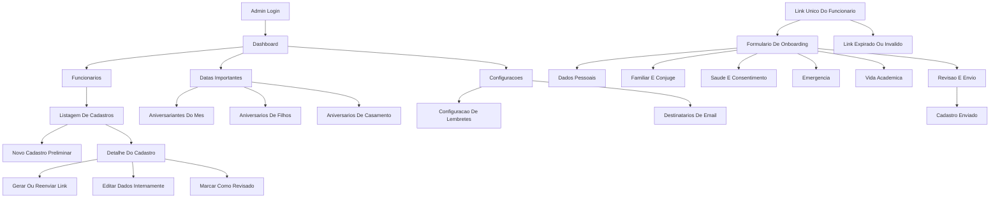
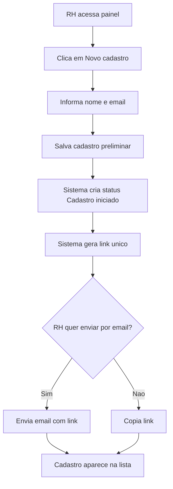
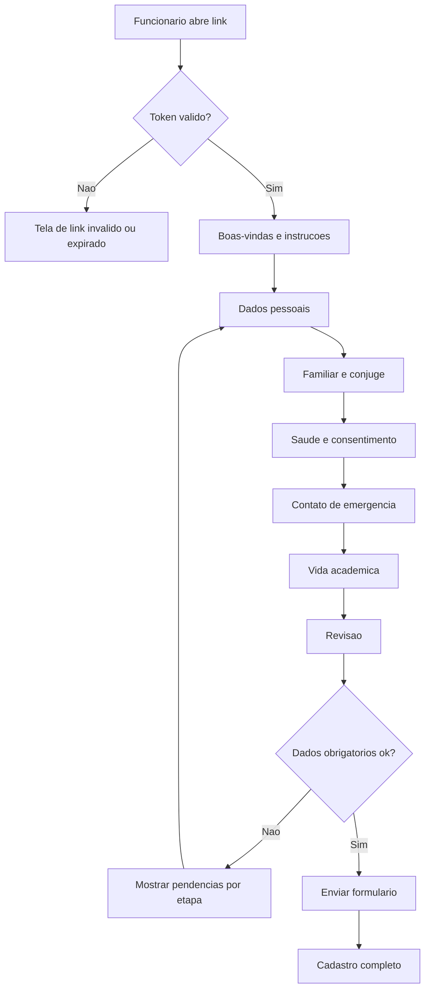
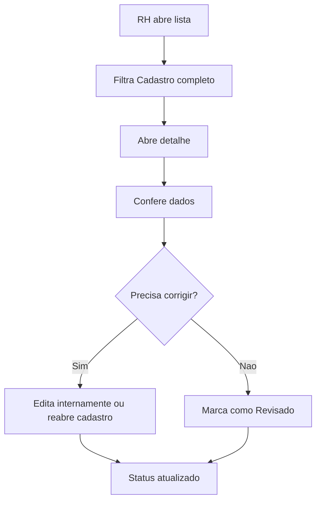
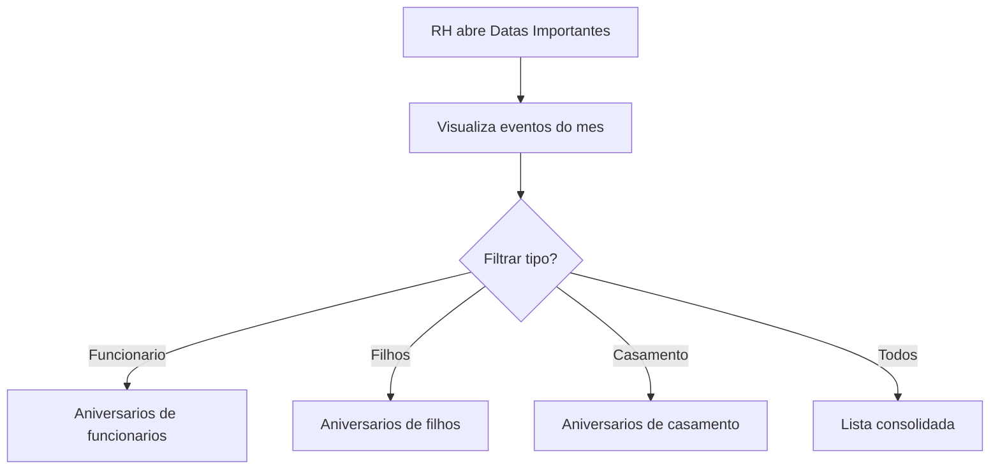

# UI/UX Specification: Sistema de Onboarding Du Ramo Locacoes

## 1. Introduction

This document defines the user experience goals, information architecture, user flows, and visual design specifications for the Sistema de Onboarding Du Ramo Locacoes user interface. It serves as the foundation for visual design and frontend development, ensuring a cohesive and user-centered experience.

Source artifacts:

- `docs/project-brief.md`
- `docs/prd.md`

### 1.1 Target User Personas

**RH / Administrativo:** usuario interno que cria cadastros preliminares, gera links, acompanha pendencias, revisa dados e consulta datas importantes.

**Gestor Autorizado:** usuario interno que precisa consultar dados relevantes de onboarding, contato de emergencia, observacoes academicas e datas familiares.

**Funcionario Em Onboarding:** pessoa convidada a preencher o formulario por link unico, sem login, normalmente em celular ou computador.

### 1.2 Usability Goals

- Um funcionario deve conseguir concluir o formulario sem treinamento.
- O RH deve conseguir criar um cadastro preliminar e copiar/enviar o link em poucos passos.
- O painel deve mostrar rapidamente quem esta pendente, completo ou revisado.
- Campos sensiveis devem ser claros, respeitosos e acompanhados de consentimento.
- Estados de link expirado, link invalido e cadastro concluido devem ser impossiveis de confundir.
- O layout deve funcionar bem em celular, pois parte dos funcionarios pode preencher pelo telefone.

### 1.3 Design Principles

1. **Clareza antes de densidade:** mostrar apenas o necessario em cada etapa do formulario.
2. **Acolhimento sem informalidade excessiva:** o tom deve ser humano, mas ainda administrativo e confiavel.
3. **Progresso visivel:** funcionarios e RH devem saber onde estao no fluxo.
4. **Seguranca perceptivel:** consentimento, link unico e bloqueios devem ser explicados de forma simples.
5. **Padroes consistentes:** formularios, filtros, status e acoes devem repetir o mesmo comportamento em todas as telas.

### 1.4 Change Log

| Date | Version | Description | Author |
| --- | --- | --- | --- |
| 2026-05-14 | 0.1 | Especificacao UX/UI inicial criada a partir do PRD | Uma / Codex |

## 2. Information Architecture

### 2.1 Site Map / Screen Inventory

### 2.2 Navigation Structure

**Primary Navigation:** Dashboard, Funcionarios, Datas Importantes, Configuracoes.

**Secondary Navigation:** filtros por status, abas no detalhe do cadastro e etapas do formulario publico.

**Breadcrumb Strategy:** usar breadcrumbs no ambiente administrativo para telas internas, por exemplo `Funcionarios > Maria Silva > Detalhe`. O formulario publico por token nao precisa breadcrumb; deve usar stepper/progresso.

## 3. User Flows

### 3.1 Criar Cadastro E Gerar Link

**User Goal:** RH cria um onboarding e entrega um link unico ao funcionario.

**Entry Points:** Dashboard, Lista de Funcionarios, botao "Novo cadastro".

**Success Criteria:** cadastro criado, link gerado, status inicial exibido e link pronto para envio/copia.

**Edge Cases & Error Handling:**

- E-mail ausente: permitir salvar cadastro, mas exigir canal antes de envio automatico.
- Falha no envio de e-mail: manter link copiavel e mostrar erro claro.
- Cadastro duplicado por nome/e-mail: alertar, mas permitir continuar com confirmacao.

### 3.2 Funcionario Preenche Formulario Por Link

**User Goal:** funcionario conclui o onboarding sem login.

**Entry Points:** link unico recebido por e-mail ou compartilhado pelo RH.

**Success Criteria:** funcionario preenche dados, aceita consentimento de saude quando aplicavel, revisa e envia.

**Edge Cases & Error Handling:**

- Link expirado: explicar que o RH deve gerar novo link.
- Link ja finalizado: informar que cadastro foi enviado e pedir contato com RH para alteracoes.
- Perda de conexao: preservar dados ja salvos quando a arquitetura permitir autosave.
- Campo obrigatorio faltando: indicar etapa e campo com erro.

### 3.3 RH Revisa Cadastro

**User Goal:** RH confere dados enviados e marca cadastro como revisado.

**Entry Points:** Dashboard, filtro "Cadastro completo", notificacao interna futura.

**Success Criteria:** RH visualiza dados, edita se necessario, reabre ou marca como revisado.

**Edge Cases & Error Handling:**

- Dados de saude: exibir aviso de dado sensivel antes do bloco.
- Reabertura: mostrar que novo link pode invalidar o anterior.
- Edicao interna: registrar ultima atualizacao.

### 3.4 Consultar Datas Importantes

**User Goal:** RH identifica proximos aniversarios e datas familiares.

**Entry Points:** Dashboard, menu Datas Importantes.

**Success Criteria:** usuario ve eventos do mes e consegue filtrar tipo de evento.

**Edge Cases & Error Handling:**

- Sem eventos no periodo: mostrar estado vazio util.
- Evento sem dado completo: sinalizar cadastro incompleto.
- Exportacao: confirmar antes de exportar dados sensiveis.

## 4. Wireframes and Key Screen Layouts

**Primary Design Files:** ainda nao definidos. Esta especificacao serve como base para Figma, Stitch, v0, Lovable ou implementacao direta.

### 4.1 Admin Login

**Purpose:** proteger acesso administrativo.

**Key Elements:**

- Logo/nome Du Ramo Locacoes.
- Campo e-mail.
- Campo senha.
- Botao entrar.
- Mensagem de erro clara.

**Interaction Notes:** tela simples, centralizada, sem conteudo de marketing.

### 4.2 Dashboard Administrativo

**Purpose:** dar visao rapida do andamento do onboarding.

**Key Elements:**

- Contadores por status.
- Lista curta de cadastros pendentes.
- Proximas datas importantes.
- Atalho para novo cadastro.
- Alertas de links expirados ou cadastros incompletos.

**Interaction Notes:** foco em leitura rapida; evitar cards decorativos em excesso.

### 4.3 Lista De Funcionarios

**Purpose:** localizar e acompanhar cadastros.

**Key Elements:**

- Busca por nome.
- Filtros por status.
- Tabela responsiva ou cards compactos no mobile.
- Colunas: nome, status, completude, ultima atualizacao, acoes.
- Botao novo cadastro.

**Interaction Notes:** em mobile, transformar tabela em cards escaneaveis.

### 4.4 Novo Cadastro Preliminar

**Purpose:** iniciar onboarding e gerar link.

**Key Elements:**

- Nome completo.
- E-mail.
- Celular opcional.
- Botao criar cadastro.
- Resultado com link gerado.
- Acoes copiar link e enviar e-mail.

**Interaction Notes:** apos criar, manter usuario na mesma tela com feedback claro.

### 4.5 Detalhe Do Cadastro

**Purpose:** revisar dados e gerenciar status.

**Key Elements:**

- Cabecalho com nome, status e completude.
- Abas: Dados pessoais, Familia, Saude, Emergencia, Educacao, Historico.
- Acoes: copiar link, gerar novo link, reabrir, marcar revisado.
- Aviso de dado sensivel no bloco de saude.

**Interaction Notes:** acoes destrutivas ou de reabertura devem ter confirmacao.

### 4.6 Formulario Publico Por Token

**Purpose:** permitir preenchimento pelo funcionario sem login.

**Key Elements:**

- Boas-vindas.
- Stepper de progresso.
- Campos por etapa.
- Campos condicionais.
- Botao salvar/continuar.
- Revisao final.
- Consentimento de saude.

**Interaction Notes:** em celular, uma etapa por vez, com botoes fixos no final da tela quando viavel.

### 4.7 Link Expirado Ou Invalido

**Purpose:** explicar bloqueio sem expor dados.

**Key Elements:**

- Mensagem simples.
- Orientacao para procurar RH.
- Sem dados do funcionario.

**Interaction Notes:** nao mostrar detalhes internos do token ou cadastro.

### 4.8 Datas Importantes

**Purpose:** facilitar planejamento de presentes e comunicacoes.

**Key Elements:**

- Filtros por mes e tipo.
- Lista de eventos.
- Tipo do evento.
- Nome relacionado.
- Data.
- Acoes futuras: marcar como tratado, exportar.

**Interaction Notes:** priorizar lista clara; calendario pode ser evolucao visual posterior.

## 5. Component Library / Design System

### 5.1 Design System Approach

Criar um design system simples e operacional desde o inicio, baseado em Atomic Design. O foco e consistencia, acessibilidade e velocidade de implementacao.

### 5.2 Core Components

#### Button

**Purpose:** executar acoes primarias e secundarias.

**Variants:** primary, secondary, ghost, destructive.

**States:** default, hover, focus, disabled, loading.

**Usage Guidelines:** uma acao primaria por area visual; acoes destrutivas sempre com confirmacao.

#### Form Field

**Purpose:** padronizar label, input, helper text e erro.

**Variants:** text, email, phone, date, textarea, select.

**States:** default, focus, error, disabled, required.

**Usage Guidelines:** todos os campos precisam de label visivel e mensagem de erro especifica.

#### Stepper

**Purpose:** mostrar progresso no formulario publico.

**Variants:** horizontal desktop, compact mobile.

**States:** pending, current, completed, error.

**Usage Guidelines:** permitir retorno a etapas anteriores antes do envio final.

#### Status Badge

**Purpose:** identificar estado do onboarding.

**Variants:** cadastro iniciado, pendente, completo, revisado, expirado.

**States:** static.

**Usage Guidelines:** usar texto e cor, nunca apenas cor.

#### Data Table / Responsive List

**Purpose:** listar funcionarios e eventos.

**Variants:** desktop table, mobile cards.

**States:** loading, empty, filtered, error.

**Usage Guidelines:** filtros devem permanecer proximos da lista.

#### Alert / Notice

**Purpose:** comunicar erro, sucesso, expiracao e dado sensivel.

**Variants:** info, success, warning, error.

**States:** visible, dismissible when appropriate.

**Usage Guidelines:** avisos de saude e LGPD nao devem ser descartaveis durante consentimento.

#### Dynamic Child Block

**Purpose:** adicionar/remover filhos no formulario.

**Variants:** collapsed summary, expanded edit.

**States:** empty, editing, complete, error.

**Usage Guidelines:** cada bloco deve ter titulo claro, como "Filho 1".

## 6. Branding and Style Guide

### 6.1 Visual Identity

**Brand Guidelines:** guia formal da Du Ramo Locacoes ainda nao fornecido.

Direcao recomendada: visual limpo, confiavel e acolhedor, com hierarquia forte e pouco ornamento. O produto e administrativo e de cuidado com pessoas; deve evitar aparencia de landing page.

### 6.2 Color Palette

| Color Type | Hex Code | Usage |
| --- | --- | --- |
| Primary | TBD | Acoes principais, links, estados ativos |
| Secondary | TBD | Destaques secundarios e navegacao |
| Accent | TBD | Datas importantes e momentos de reconhecimento |
| Success | #166534 | Confirmacoes e cadastro completo |
| Warning | #A16207 | Links expirando, pendencias e atencao |
| Error | #B91C1C | Erros e acoes destrutivas |
| Neutral | #111827, #6B7280, #E5E7EB, #F9FAFB | Texto, bordas, fundos |

### 6.3 Typography

- **Primary:** Inter, system-ui ou fonte equivalente.
- **Secondary:** mesma familia para manter simplicidade.
- **Monospace:** ui-monospace para tokens/diagnosticos, se necessario.

| Element | Size | Weight | Line Height |
| --- | --- | --- | --- |
| H1 | 28-32px | 700 | 1.2 |
| H2 | 22-24px | 700 | 1.25 |
| H3 | 18-20px | 600 | 1.3 |
| Body | 16px | 400 | 1.5 |
| Small | 14px | 400-500 | 1.4 |

### 6.4 Iconography

**Icon Library:** lucide ou biblioteca equivalente, caso o stack frontend escolhido suporte.

**Usage Guidelines:** usar icones para reforcar acoes como copiar link, enviar e-mail, editar, revisar, filtrar e exportar.

### 6.5 Spacing and Layout

**Grid System:** container central no formulario publico; layout com sidebar/topbar no admin.

**Spacing Scale:** 4, 8, 12, 16, 24, 32, 48px.

## 7. Accessibility Requirements

### 7.1 Compliance Target

**Standard:** WCAG AA como meta pratica para o MVP.

### 7.2 Key Requirements

**Visual:**

- Contraste minimo AA para texto e controles.
- Indicador de foco visivel em todos os controles.
- Nao depender apenas de cor para status.

**Interaction:**

- Navegacao por teclado em formularios, menus e tabelas.
- Touch targets de pelo menos 44px em mobile.
- Estados de erro associados aos campos.

**Content:**

- Labels visiveis em todos os inputs.
- Textos de erro objetivos.
- Hierarquia correta de headings.
- Consentimento de saude escrito em linguagem simples.

### 7.3 Testing Strategy

- Validacao manual por teclado.
- Teste com ferramenta automatizada de acessibilidade.
- Conferencia de contraste.
- Teste responsivo em mobile e desktop.

## 8. Responsiveness Strategy

### 8.1 Breakpoints

| Breakpoint | Min Width | Max Width | Target Devices |
| --- | --- | --- | --- |
| Mobile | 320px | 767px | Celulares |
| Tablet | 768px | 1023px | Tablets |
| Desktop | 1024px | 1439px | Notebooks e desktops |
| Wide | 1440px | - | Monitores largos |

### 8.2 Adaptation Patterns

**Layout Changes:** formulario publico em coluna unica; painel administrativo pode usar duas colunas no desktop.

**Navigation Changes:** admin usa sidebar/topbar no desktop e menu compacto no mobile.

**Content Priority:** no mobile, mostrar status, nome e acao principal antes de metadados.

**Interaction Changes:** tabelas viram cards; botoes principais ficam mais proximos do fluxo de leitura.

## 9. Animation and Micro-interactions

### 9.1 Motion Principles

Movimento deve ser discreto e funcional: indicar progresso, feedback de acao e transicoes entre etapas. Evitar animacoes decorativas ou lentas.

### 9.2 Key Animations

- **Stepper progress:** transicao curta ao avancar etapa (150-200ms).
- **Conditional fields:** revelar campos condicionais com fade/slide leve (150ms).
- **Save feedback:** estado loading e sucesso em botoes (imediato).
- **Status update:** pequena confirmacao visual ao marcar cadastro como revisado.

## 10. Performance Considerations

### 10.1 Performance Goals

- **Page Load:** painel e formulario devem carregar rapidamente em conexoes comuns de celular.
- **Interaction Response:** acoes de formulario devem responder em menos de 300ms quando nao dependerem de rede.
- **Animation FPS:** animacoes devem manter 60fps em dispositivos modernos.

### 10.2 Design Strategies

- Evitar paginas pesadas e bibliotecas visuais desnecessarias.
- Formularios divididos em etapas sem perder contexto.
- Carregar listas administrativas com paginacao ou busca eficiente.
- Usar estados de loading claros para chamadas de rede.
- Evitar imagens pesadas no MVP.

## 11. Open UX Decisions

1. Definir guia de marca ou cores oficiais da Du Ramo Locacoes.
2. Definir se o formulario publico deve ter autosave entre etapas.
3. Definir texto legal exato do consentimento para dados de saude.
4. Definir se a tela de datas importantes sera lista simples ou calendario desde o MVP.
5. Definir quais campos aparecem primeiro no detalhe administrativo.

## 12. Next Steps

### 12.1 Immediate Actions

1. Validar este documento com o usuario/stakeholder.
2. Definir identidade visual minima da Du Ramo Locacoes.
3. Criar wireframes de baixa fidelidade para dashboard, lista, detalhe e formulario publico.
4. Avancar para arquitetura fullstack com base no PRD e nesta especificacao.
5. Solicitar modelagem de dados ao `@data-engineer`.

### 12.2 Design Handoff Checklist

- [x] All user flows documented
- [x] Component inventory complete
- [x] Accessibility requirements defined
- [x] Responsive strategy clear
- [ ] Brand guidelines incorporated
- [x] Performance goals established

## 13. Checklist Results

Checklist formal de UX ainda nao executado. Documento pronto para revisao inicial e handoff ao Architect.

