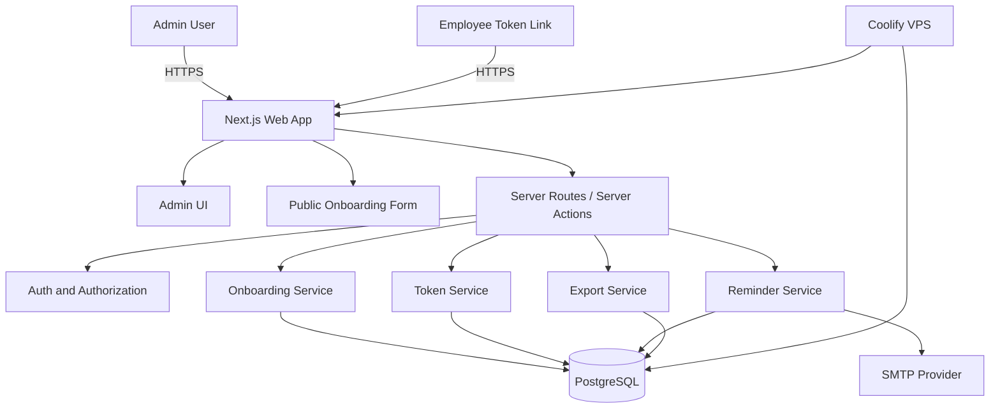
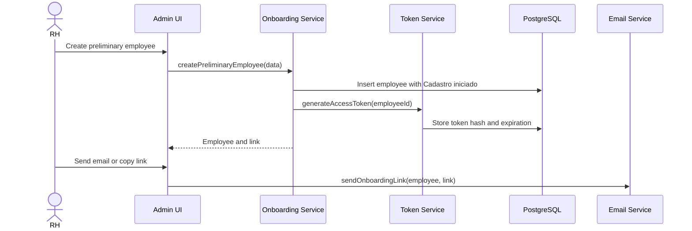
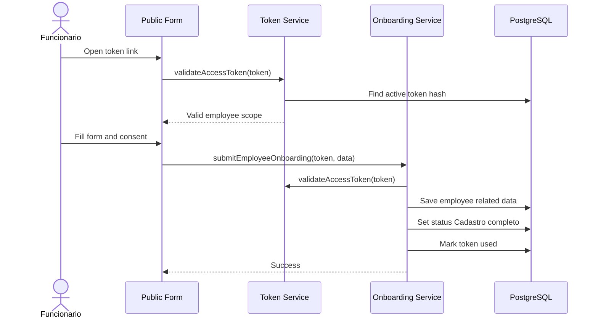
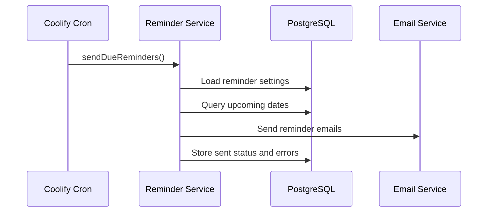
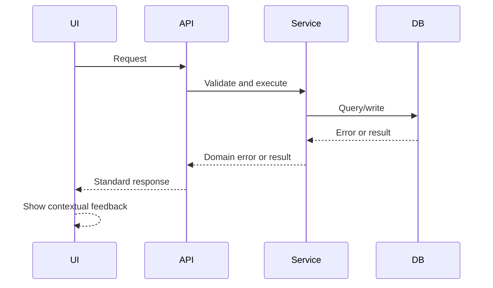

# Fullstack Architecture: Sistema de Onboarding Du Ramo Locacoes

## 1. Introduction

This document outlines the complete fullstack architecture for the Sistema de Onboarding Du Ramo Locacoes, including backend systems, frontend implementation, deployment, data model, security, and integration strategy.

Source artifacts:

- `docs/project-brief.md`
- `docs/prd.md`
- `docs/front-end-spec.md`

### 1.1 Starter Template or Existing Project

N/A - Greenfield project.

Recommended starter approach: Next.js fullstack app with TypeScript, Tailwind CSS, Prisma, PostgreSQL, and containerized deployment through Coolify.

### 1.2 Change Log

| Date | Version | Description | Author |
| --- | --- | --- | --- |
| 2026-05-14 | 0.1 | Initial fullstack architecture from PRD and UX spec | Aria / Codex |

## 2. High Level Architecture

### 2.1 Technical Summary

The system will be a fullstack web application built as a modular monolith, optimized for simple deployment on a VPS managed by Coolify. The frontend will use Next.js, React, TypeScript, Tailwind CSS, and a small component system guided by the UX specification. The backend will run inside the same Next.js application using server routes/actions for administrative workflows, public token-based form submission, reminders, and exports. PostgreSQL will store onboarding data, token metadata, administrative users, consent records, and reminder settings. This architecture keeps operational complexity low for the MVP while preserving clear boundaries for future WhatsApp, gamification, and richer audit capabilities.

### 2.2 Platform and Infrastructure Choice

**Platform:** VPS with Coolify.

**Key Services:**

- Coolify application deployment.
- PostgreSQL database, managed through Coolify or a connected database service.
- Next.js application container.
- SMTP provider for email reminders.
- Reverse proxy and HTTPS managed by Coolify.

**Deployment Host and Regions:** single VPS region selected by the business/provider.

### 2.3 Repository Structure

**Structure:** monorepo.

**Monorepo Tool:** npm workspaces initially; Turborepo can be added if build complexity grows.

**Package Organization:** one primary web app plus shared packages for types, validation schemas and reusable UI.

### 2.4 High Level Architecture Diagram



### 2.5 Architectural Patterns

- **Modular Monolith:** one deployable application with clear internal domains - _Rationale:_ simplest reliable option for VPS/Coolify and MVP scope.
- **Component-Based UI:** reusable React components with TypeScript - _Rationale:_ supports the form-heavy UX and future design system.
- **Server-Side Data Access:** backend logic kept in server-only modules - _Rationale:_ protects sensitive data and tokens.
- **Repository/Service Boundary:** domain services call database repositories - _Rationale:_ keeps business rules testable and avoids data access spread across UI.
- **Token-Based Public Access:** employees access only a scoped onboarding form through a temporary token - _Rationale:_ avoids employee login while reducing public exposure.
- **Job-Oriented Reminder Processing:** scheduled process checks important dates and sends email reminders - _Rationale:_ isolates reminder logic and prepares for future WhatsApp.

## 3. Technology Stack

| Category | Technology | Version | Purpose | Rationale |
| --- | --- | --- | --- | --- |
| Frontend Language | TypeScript | 5.x | Type-safe UI and shared contracts | Reduces form/data mistakes |
| Frontend Framework | Next.js | 16+ | Fullstack web app | Active local AIOX preset; good fit for app router and server logic |
| UI Component Library | Custom components + Radix/shadcn-compatible approach | TBD | Accessible form primitives | Speeds up admin UI without heavy design lock-in |
| Styling | Tailwind CSS | 4.x or project-supported version | Utility styling and tokens | Fast responsive UI with consistent spacing |
| State Management | Zustand | latest compatible | Lightweight client state | Useful for multi-step form state |
| Server Runtime | Node.js | 22+ or host-supported LTS | Application runtime | Matches Next.js ecosystem |
| Backend Framework | Next.js server routes/actions | 16+ | API and server logic | Keeps deployment simple |
| API Style | Server actions + REST route handlers | N/A | Internal actions and public/admin endpoints | Practical for forms, exports and scheduled jobs |
| Database | PostgreSQL | 16+ | Relational persistence | Strong fit for structured onboarding data |
| ORM | Prisma | latest compatible | Type-safe data access and migrations | Productive and clear for AI-assisted development |
| Authentication | Admin auth via credentials/session | TBD | Administrative access control | Employees do not need accounts in MVP |
| Email | SMTP provider | TBD | Reminder and link emails | Keeps provider replaceable |
| Background Jobs | Scheduled command/route via Coolify cron or worker | TBD | Reminder processing | Fits VPS deployment |
| Testing | Jest/Vitest + Testing Library + Playwright | TBD | Unit, integration, E2E | Covers form and admin workflows |
| Deployment | Docker + Coolify | TBD | Build and deploy | Matches hosting requirement |
| Monitoring | Coolify logs + app structured logs | TBD | Operational visibility | Simple MVP observability |

## 4. Data Models

### 4.1 Employee

**Purpose:** core person being onboarded.

**Key Attributes:**

- `id`: UUID.
- `fullName`: string.
- `birthDate`: date.
- `phone`: string.
- `email`: string.
- `instagram`: string nullable.
- `residentialAddress`: text.
- `status`: onboarding status.
- `completionPercent`: number.
- `createdAt`, `updatedAt`: timestamps.

**Relationships:**

- Has many children.
- Has zero or one spouse profile.
- Has one health profile.
- Has one emergency contact.
- Has zero or one education profile.
- Has many access tokens.
- Has many reminder events.

### 4.2 OnboardingAccessToken

**Purpose:** secure employee access without login.

**Key Attributes:**

- `id`: UUID.
- `employeeId`: UUID.
- `tokenHash`: string.
- `expiresAt`: timestamp.
- `usedAt`: timestamp nullable.
- `revokedAt`: timestamp nullable.
- `createdAt`: timestamp.

**Relationships:**

- Belongs to employee.

### 4.3 Child

**Purpose:** child birthday and family information.

**Key Attributes:**

- `id`: UUID.
- `employeeId`: UUID.
- `name`: string.
- `gender`: string.
- `birthDate`: date.

### 4.4 Spouse

**Purpose:** spouse/partner information and wedding anniversary.

**Key Attributes:**

- `id`: UUID.
- `employeeId`: UUID.
- `name`: string.
- `phone`: string.
- `weddingAnniversary`: date.

### 4.5 HealthProfile

**Purpose:** sensitive health and emergency-relevant notes.

**Key Attributes:**

- `id`: UUID.
- `employeeId`: UUID.
- `continuousMedication`: text nullable.
- `allergies`: text nullable.
- `relevantCondition`: text nullable.
- `workRestriction`: text nullable.
- `additionalNotes`: text nullable.
- `consentAcceptedAt`: timestamp nullable.

### 4.6 EmergencyContact

**Purpose:** emergency responsible contact.

**Key Attributes:**

- `id`: UUID.
- `employeeId`: UUID.
- `name`: string.
- `phone`: string.
- `address`: text.

### 4.7 EducationProfile

**Purpose:** academic schedule information impacting work scale.

**Key Attributes:**

- `id`: UUID.
- `employeeId`: UUID.
- `institution`: string.
- `courseName`: string.
- `courseSchedule`: text.
- `expectedEndDate`: date nullable.

### 4.8 AdminUser

**Purpose:** internal authenticated user.

**Key Attributes:**

- `id`: UUID.
- `name`: string.
- `email`: string.
- `passwordHash`: string.
- `role`: enum.
- `createdAt`, `updatedAt`: timestamps.

### 4.9 ReminderSetting and ReminderEvent

**Purpose:** configure and track important date reminders.

**Key Attributes:**

- `ReminderSetting`: recipients, daysBefore, enabled flags.
- `ReminderEvent`: employeeId, type, eventDate, relatedName, sentAt, status.

## 5. API Specification

Initial API style: Next.js route handlers for public token actions, admin operations, exports and scheduled reminders.

### 5.1 Public Token Routes

- `GET /onboarding/[token]`: renders public form after token validation.
- `POST /api/public/onboarding/[token]/save-draft`: optional draft save if autosave is enabled.
- `POST /api/public/onboarding/[token]/submit`: validates and submits final onboarding data.

### 5.2 Admin Routes

- `POST /api/admin/auth/login`
- `POST /api/admin/auth/logout`
- `GET /api/admin/employees`
- `POST /api/admin/employees`
- `GET /api/admin/employees/:id`
- `PATCH /api/admin/employees/:id`
- `POST /api/admin/employees/:id/tokens`
- `POST /api/admin/employees/:id/reopen`
- `POST /api/admin/employees/:id/mark-reviewed`
- `GET /api/admin/important-dates`
- `GET /api/admin/export/employees`
- `GET /api/admin/export/important-dates`

### 5.3 Scheduled Routes or Commands

- `POST /api/jobs/send-reminders`, protected by internal job secret, or equivalent CLI command run by Coolify cron.

## 6. Components and Services

### 6.1 Admin UI

**Responsibility:** login, dashboard, employee list, detail, link generation, review and date views.

**Key Interfaces:**

- Admin auth service.
- Employee service.
- Reminder service.

**Dependencies:** Next.js, UI components, server routes/actions.

### 6.2 Public Form UI

**Responsibility:** token-based employee onboarding form.

**Key Interfaces:**

- Token validation.
- Submit onboarding.
- Conditional form validation.

**Dependencies:** form components, validation schemas, onboarding service.

### 6.3 Onboarding Service

**Responsibility:** create, update, submit, reopen and review onboarding records.

**Key Interfaces:**

- `createPreliminaryEmployee`
- `submitEmployeeOnboarding`
- `reopenOnboarding`
- `markReviewed`

**Dependencies:** employee repository, token service, validation schemas.

### 6.4 Token Service

**Responsibility:** generate, hash, validate, revoke and expire access tokens.

**Key Interfaces:**

- `generateAccessToken`
- `validateAccessToken`
- `revokeEmployeeTokens`

**Dependencies:** token repository, secure random generator.

### 6.5 Reminder Service

**Responsibility:** discover upcoming events and send email reminders.

**Key Interfaces:**

- `listImportantDates`
- `sendDueReminders`
- `configureReminderSettings`

**Dependencies:** employee/child/spouse repositories, email service.

### 6.6 Email Service

**Responsibility:** send onboarding links and reminder notifications.

**Key Interfaces:**

- `sendOnboardingLink`
- `sendReminderEmail`

**Dependencies:** SMTP provider.

## 7. Core Workflows

### 7.1 Create Onboarding Link



### 7.2 Employee Submit Form



### 7.3 Send Reminders



## 8. Database Schema Draft

Detailed schema should be finalized by `@data-engineer`. Initial SQL-oriented structure:

```sql
CREATE TYPE onboarding_status AS ENUM (
  'cadastro_iniciado',
  'pendente_informacoes',
  'cadastro_completo',
  'revisado'
);

CREATE TYPE admin_role AS ENUM ('admin', 'rh', 'gestor');

CREATE TABLE employees (
  id UUID PRIMARY KEY,
  full_name TEXT NOT NULL,
  birth_date DATE,
  phone TEXT,
  email TEXT,
  instagram TEXT,
  residential_address TEXT,
  status onboarding_status NOT NULL DEFAULT 'cadastro_iniciado',
  completion_percent INTEGER NOT NULL DEFAULT 0,
  created_at TIMESTAMPTZ NOT NULL DEFAULT now(),
  updated_at TIMESTAMPTZ NOT NULL DEFAULT now()
);

CREATE TABLE onboarding_access_tokens (
  id UUID PRIMARY KEY,
  employee_id UUID NOT NULL REFERENCES employees(id) ON DELETE CASCADE,
  token_hash TEXT NOT NULL UNIQUE,
  expires_at TIMESTAMPTZ NOT NULL,
  used_at TIMESTAMPTZ,
  revoked_at TIMESTAMPTZ,
  created_at TIMESTAMPTZ NOT NULL DEFAULT now()
);

CREATE TABLE children (
  id UUID PRIMARY KEY,
  employee_id UUID NOT NULL REFERENCES employees(id) ON DELETE CASCADE,
  name TEXT NOT NULL,
  gender TEXT,
  birth_date DATE NOT NULL
);

CREATE TABLE spouses (
  id UUID PRIMARY KEY,
  employee_id UUID NOT NULL UNIQUE REFERENCES employees(id) ON DELETE CASCADE,
  name TEXT NOT NULL,
  phone TEXT,
  wedding_anniversary DATE
);

CREATE TABLE health_profiles (
  id UUID PRIMARY KEY,
  employee_id UUID NOT NULL UNIQUE REFERENCES employees(id) ON DELETE CASCADE,
  continuous_medication TEXT,
  allergies TEXT,
  relevant_condition TEXT,
  work_restriction TEXT,
  additional_notes TEXT,
  consent_accepted_at TIMESTAMPTZ
);

CREATE TABLE emergency_contacts (
  id UUID PRIMARY KEY,
  employee_id UUID NOT NULL UNIQUE REFERENCES employees(id) ON DELETE CASCADE,
  name TEXT NOT NULL,
  phone TEXT NOT NULL,
  address TEXT
);

CREATE TABLE education_profiles (
  id UUID PRIMARY KEY,
  employee_id UUID NOT NULL UNIQUE REFERENCES employees(id) ON DELETE CASCADE,
  institution TEXT,
  course_name TEXT,
  course_schedule TEXT,
  expected_end_date DATE
);

CREATE TABLE admin_users (
  id UUID PRIMARY KEY,
  name TEXT NOT NULL,
  email TEXT NOT NULL UNIQUE,
  password_hash TEXT NOT NULL,
  role admin_role NOT NULL DEFAULT 'rh',
  created_at TIMESTAMPTZ NOT NULL DEFAULT now(),
  updated_at TIMESTAMPTZ NOT NULL DEFAULT now()
);
```

Recommended indexes:

- `employees(status)`
- `employees(full_name)`
- `onboarding_access_tokens(token_hash)`
- `onboarding_access_tokens(expires_at)`
- `children(employee_id, birth_date)`
- `spouses(wedding_anniversary)`
- `employees(birth_date)`

## 9. Frontend Architecture

### 9.1 Component Organization

```text
src/
  app/
    (admin)/
      login/
      dashboard/
      funcionarios/
      datas-importantes/
      configuracoes/
    onboarding/
      [token]/
  components/
    ui/
    forms/
    admin/
    onboarding/
  features/
    auth/
    employees/
    tokens/
    reminders/
  lib/
    api/
    validation/
    formatting/
```

### 9.2 State Management

- Keep server data on the server where possible.
- Use URL/search params for filters.
- Use local form state for multi-step onboarding.
- Use Zustand only for cross-step draft state if needed.
- Keep validation schemas shared between frontend and backend.

### 9.3 Routing

Admin routes:

- `/login`
- `/dashboard`
- `/funcionarios`
- `/funcionarios/novo`
- `/funcionarios/[id]`
- `/datas-importantes`
- `/configuracoes/lembretes`

Public routes:

- `/onboarding/[token]`
- `/onboarding/[token]/concluido`
- `/onboarding/link-expirado`

## 10. Backend Architecture

### 10.1 Server Modules

```text
src/server/
  auth/
  employees/
  onboarding/
  tokens/
  reminders/
  email/
  export/
  db/
  jobs/
```

### 10.2 Data Access

- Prisma client must live in a server-only module.
- UI components must not call Prisma directly.
- All writes must pass through service functions.
- Public token submissions must validate token scope before loading employee data.

### 10.3 Authentication and Authorization

Admin users authenticate with credentials/session. Employees do not authenticate; they access only via a scoped token.

Authorization rules:

- Admin/RH/Gestor can access admin panel after login.
- Public token can access only its employee form.
- Used, expired or revoked tokens cannot update data.
- Job endpoint requires internal secret if exposed as HTTP route.

## 11. Unified Project Structure

```text
onborading/
  apps/
    web/
      src/
        app/
        components/
        features/
        server/
        styles/
      public/
      prisma/
      tests/
      Dockerfile
      package.json
  packages/
    shared/
      src/
        types/
        validation/
        constants/
    ui/
      src/
        components/
  docs/
    project-brief.md
    prd.md
    front-end-spec.md
    fullstack-architecture.md
  .env.example
  docker-compose.yml
  package.json
```

Note: this repository currently contains AIOX framework files. The implementation structure should be added without deleting existing AIOX directories.

## 12. Development Workflow

### 12.1 Prerequisites

```bash
node --version
npm --version
docker --version
```

### 12.2 Initial Setup

```bash
npm install
npm run db:migrate
npm run dev
```

### 12.3 Required Environment Variables

```bash
DATABASE_URL=
APP_URL=https://onboarding.duramo.com.br
SESSION_SECRET=
TOKEN_SECRET=
SMTP_HOST=
SMTP_PORT=
SMTP_USER=
SMTP_PASS=
SMTP_FROM=
JOB_SECRET=
```

## 13. Deployment Architecture

### 13.1 Deployment Strategy

**Frontend Deployment:**

- **Platform:** Coolify on VPS.
- **Build Command:** `npm run build`.
- **Output:** Next.js production server/container.
- **CDN/Edge:** not required for MVP.

**Backend Deployment:**

- **Platform:** same Next.js container.
- **Build Command:** `npm run build`.
- **Deployment Method:** Docker container managed by Coolify.

**Database:**

- PostgreSQL managed by Coolify or a connected database service.
- Backups must be configured before production use.

### 13.2 Environments

| Environment | Frontend URL | Backend URL | Purpose |
| --- | --- | --- | --- |
| Development | `http://localhost:3000` | same origin | Local development |
| Staging | TBD | same origin | Pre-production testing |
| Production | `https://onboarding.duramo.com.br` | same origin | Live environment |

## 14. Security and Performance

### 14.1 Security Requirements

**Frontend Security:**

- Do not expose token validation details.
- Do not store health data in local storage.
- Use clear warnings for sensitive data consent.

**Backend Security:**

- Validate every input with shared schemas.
- Hash access tokens before storage.
- Use secure random token generation.
- Rate-limit public token routes.
- Apply strict CORS for same-origin app.
- Protect export routes with admin auth.

**Authentication Security:**

- Store sessions in secure HTTP-only cookies.
- Hash admin passwords with a strong password hashing algorithm.
- Use HTTPS in production.
- Use strong secrets from environment variables.

### 14.2 Performance Optimization

**Frontend:**

- Keep forms split by step.
- Avoid heavy visual libraries.
- Use server-rendered admin pages where practical.
- Use loading and empty states consistently.

**Backend:**

- Index status, token hash and date fields.
- Paginate employee lists.
- Keep reminder queries date-window based.
- Avoid loading health data into exports unless explicitly requested.

## 15. Testing Strategy

### 15.1 Testing Pyramid

```text
          E2E Tests
       Integration Tests
  Frontend Unit   Backend Unit
```

### 15.2 Required Test Coverage

Frontend:

- Form step navigation.
- Conditional fields for children, spouse and education.
- Consent validation for health section.
- Link expired and completed states.
- Admin list filters and status badges.

Backend:

- Token generation, hashing, expiration and revocation.
- Employee submit workflow.
- Reopen and mark reviewed workflow.
- Reminder date calculation.
- Export authorization.

E2E:

- RH creates employee and copies link.
- Employee completes form through token.
- RH reviews and marks as reviewed.
- Reminder list shows relevant birthday events.

## 16. Coding Standards

### 16.1 Critical Fullstack Rules

- **Server-only data access:** Prisma and database queries must stay in server modules.
- **Token safety:** never store raw token values, only hashes.
- **Shared validation:** form and API validation must use shared schemas.
- **Sensitive data:** health data must not be logged, stored in local storage or included in default exports.
- **Status transitions:** onboarding status changes must go through service functions.
- **Environment variables:** access through typed config helpers, not scattered `process.env` usage.
- **No direct external coupling:** email and future WhatsApp must go through provider interfaces.

### 16.2 Naming Conventions

| Element | Frontend | Backend | Example |
| --- | --- | --- | --- |
| Components | PascalCase | - | `EmployeeStatusBadge.tsx` |
| Hooks | camelCase with `use` | - | `useOnboardingForm.ts` |
| Server Services | - | camelCase file names | `tokenService.ts` |
| API Routes | kebab-case | kebab-case | `/api/admin/important-dates` |
| Database Tables | - | snake_case | `onboarding_access_tokens` |

## 17. Error Handling Strategy

### 17.1 Error Flow



### 17.2 Error Response Format

```typescript
interface ApiError {
  error: {
    code: string;
    message: string;
    details?: Record<string, unknown>;
    timestamp: string;
    requestId: string;
  };
}
```

### 17.3 User-Facing Error Examples

- Link expirado: "Este link expirou. Solicite um novo link ao RH."
- Link concluido: "Este cadastro ja foi enviado. Para alterar informacoes, fale com o RH."
- Campo obrigatorio: "Preencha o nome completo para continuar."
- Consentimento ausente: "Para enviar informacoes de saude, aceite o consentimento."

## 18. Monitoring and Observability

### 18.1 Monitoring Stack

- **Frontend Monitoring:** basic web vitals and error logs in future phase.
- **Backend Monitoring:** Coolify logs and structured application logs.
- **Error Tracking:** optional service in later phase.
- **Performance Monitoring:** response time logs for key routes.

### 18.2 Key Metrics

Frontend:

- Form completion rate.
- Step abandonment.
- Link expired views.
- JavaScript errors.

Backend:

- Request rate.
- Error rate.
- Token validation failures.
- Reminder send success/failure.
- Database query performance for lists and reminders.

## 19. Architecture Risks and Follow-Ups

1. Confirm SMTP provider before implementation of reminders.
2. Confirm whether autosave is required for public form.
3. Confirm admin roles and whether "todos" means all internal admin users or literally every authenticated employee in a future phase.
4. Ask `@data-engineer` to finalize schema, indexes and retention strategy.
5. Ask `@devops` to define Coolify deployment variables, backups and SSL setup.

## 20. Checklist Results

Architecture checklist not executed yet. Document is ready for stakeholder review and data-engineering refinement.

