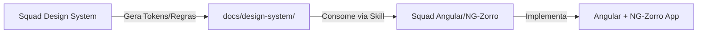

# Guia Completo: Criação da Squad Angular/NG-Zorro no AIOX - Antigravity

> **Documento:** `docs/pt/antigravity/guia-criacao-squad-angular-ng-zorro.md`  
> **Versão:** 1.0  
> **Audiência:** Desenvolvedores e Arquitetos usando o AIOX - Antigravity  
> **Pré-requisito:** Ter o `modulo-antigravity` instalado e configurado

---

## 📋 Sumário

1. [Visão Geral da Estratégia](#1-visão-geral-da-estratégia)
2. [Entendendo o Ecossistema AIOX para Squads](#2-entendendo-o-ecossistema-aiox-para-squads)
3. [Fase de Planejamento: Definindo a Squad](#3-fase-de-planejamento-definindo-a-squad)
4. [Passo a Passo: Criação da Squad](#4-passo-a-passo-criação-da-squad)
5. [Especialização dos Agentes: Estratégia Completa](#5-especialização-dos-agentes-estratégia-completa)
6. [Definição dos Agentes Especializados](#6-definição-dos-agentes-especializados)
7. [Skills e Knowledge Base (NotebookLM)](#7-skills-e-knowledge-base-notebooklm)
8. [Workflows da Squad Angular](#8-workflows-da-squad-angular)
9. [Processo Completo: Do PRD ao Deploy](#9-processo-completo-do-prd-ao-deploy)
10. [Integração com os Agentes Nativos do AIOX](#10-integração-com-os-agentes-nativos-do-aiox)
11. [Quality Gates e Checklists](#11-quality-gates-e-checklists)
12. [Configuração do NotebookLM para a Squad](#12-configuração-do-notebooklm-para-a-squad)
13. [Integração Cross-Squad: Design System + Angular](#13-integração-cross-squad-design-system-angular)
14. [Registro e Ativação da Squad](#14-registro-e-ativação-da-squad)

---

## 1. Visão Geral da Estratégia

### O Que é a Squad Angular/NG-Zorro?

A **Squad Angular/NG-Zorro** é uma squad especializada dentro do ecossistema AIOX - Antigravity, projetada para cobrir **todo o ciclo de desenvolvimento de aplicações Angular Enterprise** utilizando o framework **NG-Zorro (Ant Design para Angular)**.

Esta squad **não substitui os agentes nativos do AIOX** (`@dev`, `@architect`, `@qa`, etc.), mas **estende e especializa** cada um deles com conhecimento profundo de:

- **Angular 21+** (signals, standalone components, deferrable views, hydration)
- **NG-Zorro** (componentes Ant Design para Angular)
- **Design Patterns** específicos para Angular Enterprise
- **Melhores práticas** de performance, acessibilidade e arquitetura

### Princípio Fundamental: Especialização por Camadas

```
AIOX Nativo (Base)           Squad Angular/NG-Zorro (Extensão)
─────────────────────────────────────────────────────────────
@pm (Product Manager)    ──► @angular-pm (Story com contexto Angular)
@architect (Aria)        ──► @angular-architect (Padrões Angular Enterprise)  
@dev (Dex)               ──► @angular-dev (Implementação Angular/NG-Zorro)
@qa (Quinn)              ──► @angular-qa (Testes Angular Jest/Playwright)
@ux-design-expert        ──► @angular-ui-builder (NG-Zorro Components)
@data-engineer           ──► (Agente nativo - banco é agnóstico de framework)
@devops (Gage)           ──► @angular-devops (Angular CLI, build, CI/CD Angular)
```

### Onde a Squad Vive

```
squads/
└── angular-ng-zorro/              ← Pasta da Squad
    ├── agents/                    ← 7 agentes especializados
    ├── skills/                    ← Skills com conhecimento Angular
    ├── workflows/                 ← Workflows adaptados para Angular
    ├── checklists/                ← Quality gates específicos
    ├── data/                      ← Registry, config, knowledge base
    ├── tasks/                     ← Task files especializados
    └── README.md                  ← Documentação da squad
```

> **REGRA DO AIOX:** Squads **globais** (reutilizáveis entre projetos) ficam em `.antigravity/squads/`.  
> Squads **específicas de projeto** ficam em `squads/` na raiz do projeto.  
> A Squad Angular/NG-Zorro é **global** → `.antigravity/squads/angular-ng-zorro/`

---

## 2. Entendendo o Ecossistema AIOX para Squads

Antes de criar a squad, você precisa entender como o AIOX organiza squads:

### 2.1 Estrutura de uma Squad AIOX

Toda squad AIOX segue esta estrutura:

```
{squad-slug}/
├── squad.yaml               ← Manifesto da squad (OBRIGATÓRIO)
├── README.md                ← Documentação e instruções de uso
├── agents/                  ← Definições dos agentes (.md)
│   └── @{agent-name}.md
├── skills/                  ← Skills que os agentes usam
│   └── skill-{name}.md
├── workflows/               ← Workflows específicos da squad
│   └── {workflow}.md
├── tasks/                   ← Task files de execução
│   └── {task}.md
└── checklists/              ← Checklists de qualidade
    └── {checklist}.md
```

### 2.2 Como Agentes de Squad Diferem de Agentes Nativos

| Característica | Agente Nativo (`@dev`) | Agente de Squad (`@angular-dev`) |
|---|---|---|
| **Localização** | `.antigravity/agents/` | `.antigravity/squads/{squad}/agents/` |
| **Escopo** | Generalista | Ultra-especializado |
| **Skills** | Skills gerais | Skills do domínio |
| **Ativação** | `@dev` | Ativar a squad, depois `@angular-dev` |
| **Contexto** | Qualquer projeto | Projetos Angular/NG-Zorro |

### 2.3 O Princípio MINDS FIRST do `@squad-chief`

O `@squad-chief` do AIOX segue um princípio crítico: **sempre pesquisar mentes reais antes de criar agentes**. Para a Squad Angular/NG-Zorro, as mentes de referência são especialistas reais cujos frameworks, livros e metodologias documentadas servirão de base para os agentes.

---

## 3. Fase de Planejamento: Definindo a Squad

### 3.1 PRD da Squad: Esboço Inicial

Antes de executar o workflow de criação, defina o PRD da própria squad:

```markdown
# PRD: Squad Angular/NG-Zorro para AIOX - Antigravity

## Objetivo
Criar uma squad especializada em desenvolvimento Angular Enterprise com NG-Zorro,
capaz de guiar um projeto desde o PRD até o deploy, com conhecimento especializado
em Angular 21+, padrões de projeto, e melhores práticas.

## Agentes Necessários
1. @angular-pm — Product Manager com contexto Angular/enterprise
2. @angular-architect — Arquiteto especializado em Angular Enterprise patterns
3. @angular-dev — Developer Angular/NG-Zorro implementation
4. @angular-ui-builder — UI Builder focado em componentes NG-Zorro
5. @angular-qa — QA especializado em testes Angular
6. @angular-devops — DevOps com foco em Angular CLI, build optimization
7. @angular-sm — Scrum Master com foco em stories Angular

## Stack Alvo
- Angular 21+ (Standalone, Signals, Deferrable Views)
- NG-Zorro (Ant Design Angular)
- TypeScript strict mode
- RxJS 7+
- Angular Material (opcional, quando solicitado)

## Critérios de Sucesso
- Cada agente deve saber implementar componentes NG-Zorro corretamente
- Todos os agentes devem conhecer Angular 21+ features avançadas
- QA deve saber testar com Jest + Angular Testing Library + Playwright
- Arquiteto deve conhecer todos os padrões de design Angular enterprise
```

### 3.2 Mentes de Referência para Pesquisa

O `@squad-chief` vai pesquisar estas categorias de especialistas:

| Categoria | Mentes a Pesquisar |
|---|---|
| **Angular Core** | Ward Bell, John Papa, Minko Gechev (Google Angular team) |
| **Enterprise Architecture** | Thomas Burleson, Manfred Steyer, Nrwl/Nx team |
| **Testing Angular** | Tim Deschryver, Kevin Kreuzer |
| **Performance Angular** | Younes Jaaidi, Christian Lüdemann |
| **NG-Zorro/Ant Design** | Vitor Campos (NG-Zorro contributors) |

---

## 4. Passo a Passo: Criação da Squad

### Step 0: Inicialização do Contexto

Certifique-se de que o AIOX está inicializado na pasta do seu projeto.

**No chat:**
```
Quero criar uma squad especializada em Angular 21+ com NG-Zorro.
```

### Step 1: Ativar o `@squad-chief`

```
@squad-chief
```

O Squad Chief vai exibir:
```
🎨 Squad Architect (Domain Expert Creator) — pronto.
Clone minds > create bots. Research first, ask questions later.
```

### Step 2: Solicitar Pesquisa de Mentes

```
*research-minds Angular Enterprise com NG-Zorro, Angular 21+, Design Patterns
```

O `@squad-chief` vai:
1. Executar `mind-research-loop.md` com **3-5 iterações**
2. Pesquisar mentes reais no domínio Angular Enterprise
3. Validar cada mente com `mind-validation.md`
4. Apresentar lista curada de mentes com frameworks documentados

**Resultado esperado:**
```
Pesquisei X especialistas. Aqui estão as 5+ mentes de elite com frameworks documentados:

1. Ward Bell — Component Design Patterns, Smart/Dumb Components Architecture
2. John Papa — Angular Style Guide, Enterprise Coding Standards
3. Manfred Steyer — Angular Micro-Frontend Architecture (NGRX Façade Pattern)
4. Thomas Burleson — Redux/NGRX State Management Patterns
5. Tim Deschryver — Angular Testing Strategies, Testing Library
6. Younes Jaaidi — Angular Component Architecture, Performance Patterns
7. Christian Lüdemann — Angular Architecture Patterns

Devo criar agentes baseados nessas mentes?
```

### Step 3: Aprovar e Clonar DNA

Após aprovação, o `@squad-chief` executa para cada mente:

```
*clone-mind [Nome da Mente]
```

Para cada mente aprovada:
1. Executa `clone-mind.md` workflow
2. Pesquisa fontes primárias (livros, artigos, talks, GitHub)
3. **PAUSA no Checkpoint L6** para validação humana
4. Extrai Voice DNA (como a pessoa comunica)
5. Extrai Thinking DNA (frameworks e heurísticas)
6. Gera `mind_dna_complete.yaml`

### Step 4: Criar os Agentes com DNA

```
*create-squad angular-ng-zorro
```

Para cada agente, o Squad Chief executa:
1. Usa `mind_dna_complete.yaml` como base
2. Cria arquivo de agente em `.antigravity/squads/angular-ng-zorro/agents/`
3. Valida contra Quality Gates `SC_AGT_001` e `SC_AGT_002`

### Step 5: Criar Estrutura Completa

O Squad Chief cria automaticamente toda a estrutura de pastas e arquivos.

### Step 6: Registrar no Squad Registry

Adiciona a squad ao `squads/squad-creator/data/squad-registry.yaml`.

---

### 5.1 A Trindade da Especialização

Para garantir que a squad opere em nível de elite, a especialização é estruturada em três camadas interdependentes que formam a "identidade técnica" do agente:

1.  **Persona (O Coração - DNA)**: O mindset e heurísticas de decisão. Baseada na clonagem de mentes reais, define *como o agente pensa* e quais são seus princípios inalienáveis.
2.  **NotebookLM (O Cérebro - Conhecimento)**: A fonte da verdade técnica dinâmica. Mantém o agente atualizado com Angular 21+, NG-Zorro API e diretrizes específicas do projeto.
3.  **Skills (As Mãos - Execução)**: O conjunto de SOPs (Standard Operating Procedures). Define as ações práticas, uso de ferramentas (Stitch, Browser) e checklists de padronização.

### 5.2 O Que Cada Agente DEVE Saber de Angular 21+

#### Conhecimento Transversal (TODOS os agentes):

```yaml
angular_core_knowledge:
  standalone_components:
    - "Todo novo componente é standalone por padrão"
    - "NgModules são legacy — evitar em código novo"
    - "bootstrapApplication() substitui AppModule"
    
  signals:
    - "signal(), computed(), effect() são os primitivos base"
    - "Substituem comportamento de @Input() e output() em composição"
    - "input() signal-based inputs em vez de @Input decorator"
    - "output() signal-based outputs em vez de @Output + EventEmitter"
    - "linkedSignal() para sinais derivados com efeito cascata"
    - "toSignal() para converter Observables em Signals"
    - "toObservable() para o caminho inverso"
    
  change_detection:
    - "OnPush é o padrão recomendado para TODOS os componentes"
    - "Signals automaticamente marcam componentes como dirty"
    - "Zoneless approach disponível como experimental"
    
  deferrable_views:
    - "@defer, @placeholder, @loading, @error são blocos de controle"
    - "Permite lazy loading de partes do template"
    - "Triggers: on idle, on viewport, on interaction, on timer, when"
    
  control_flow:
    - "@if/@else substitui *ngIf"
    - "@for substitui *ngFor (com obrigatoriedade de track)"
    - "@switch substitui ngSwitch"
    - "@empty para listas vazias no @for"
    
  hydration:
    - "provideClientHydration() para SSR com Angular 17+"
    - "skipHydration attribute para componentes problemáticos"
    - "Event replay com withEventReplay()"
```

### 5.3 Conhecimento Específico de NG-Zorro

```yaml
ng_zorro_knowledge:
  version: "Ant Design for Angular — última versão estável"
  
  setup:
    - "ng add ng-zorro-antd — instalação via CLI"
    - "Configurar en_US ou pt_BR locale no app.config.ts"
    - "Importar apenas módulos necessários (tree-shaking)"
    
  component_categories:
    layout: ["nz-layout", "nz-sider", "nz-header", "nz-content", "nz-footer"]
    navigation: ["nz-menu", "nz-breadcrumb", "nz-tabs", "nz-steps"]
    data_entry: ["nz-form", "nz-input", "nz-select", "nz-date-picker", "nz-checkbox"]
    data_display: ["nz-table", "nz-list", "nz-card", "nz-tree", "nz-descriptions"]
    feedback: ["nz-modal", "nz-drawer", "nz-notification", "nz-message", "nz-spin"]
    charts: ["Integração com G2 ou ECharts via biblioteca separada"]
    
  patterns:
    - "Usar NzSafeAny para tipagem de dados Ant Design onde necessário"
    - "NzConfigService para customizar temas globalmente"
    - "Usar forRoot() apenas uma vez na aplicação"
    - "Standalone imports: importar NzButtonModule, NzInputModule individualmente"
    
  theming:
    - "CSS variables para customização sem rebuild"
    - "less variables para customização com rebuild (legado)"
    - "@use 'ng-zorro-antd/ng-zorro-antd.less' como entry point"
    - "Suporte a dark mode via prefers-color-scheme"
```

### 5.4 Padrões de Projeto Específicos para Angular Enterprise

Todos os agentes devem conhecer os seguintes padrões:

```yaml
design_patterns:
  
  smart_dumb_pattern:
    description: "Separação entre componentes de lógica e apresentação"
    smart_component: "Conectado ao estado, faz chamadas de serviço"
    dumb_component: "Recebe dados via @Input, emite eventos via @Output"
    rule: "Dumb components com OnPush sempre. Smart com Default apenas se necessário."
    
  facade_pattern:
    description: "Service que atua como fachada para o state management"
    example: |
      // Ao invés de usar o store diretamente no componente:
      // store.dispatch(loadUsers())
      // Usar via Facade:
      usersService.loadUsers()
      
  repository_pattern:
    description: "Serviços de acesso a dados isolados da lógica de negócio"
    rule: "HttpClient apenas em classes @Injectable com 'Repository' ou 'Api' suffix"
    
  feature_shell_pattern:
    description: "Padrão NX para estruturar features grandes"
    structure: "feature-shell → feature-list → feature-detail → data-access"
    
  resolver_vs_guard:
    description: "Escolha certa entre resolver e guard"
    resolver: "Para pré-carregar dados antes de renderizar a rota"
    guard: "Para controle de acesso — CanActivate, CanDeactivate"
    
  signal_store_pattern:
    description: "State management com NgRx Signal Store (Angular 17+)"
    example: |
      const UsersStore = signalStore(
        { providedIn: 'root' },
        withState({ users: [] as User[], loading: false }),
        withMethods((store) => ({
          loadUsers: rxMethod<void>(...)
        }))
      )
      
  injection_token_pattern:
    description: "Injeção de dependência com InjectionToken tipado"
    rule: "Evitar formas não-tipadas de DI. InjectionToken<T> sempre tipado."
```

---

## 6. Definição dos Agentes Especializados

### Agente 1: `@angular-architect` (Baseado em Manfred Steyer + Ward Bell)

**Arquivo:** `.antigravity/squads/angular-ng-zorro/agents/@angular-architect.md`

**Especialização:**
- Arquitetura monorepo com NX e Angular
- Micro-Frontend com Module Federation + Angular
- Domain-Driven Design em Angular
- NGRX / Signal Store architecture
- Standalone API migration patterns
- Performance budgets e lazy loading strategies

**Heurísticas Principais (SE/ENTÃO):**
```
SE a feature tem mais de 5 componentes → ENTÃO criar feature module com lazy loading
SE o app vai ter micro-frontends → ENTÃO usar NX + Module Federation desde o início
SE existe shared state entre features → ENTÃO usar NGRX Signal Store ou serviço Singleton
SE o componente só recebe dados → ENTÃO SEMPRE usar OnPush + standalone
SE existe lógica de negócio no componente → ENTÃO extrair para service/facade
```

**Responsabilidades:**
- Criar `docs/architecture/angular-architecture.md`
- Definir estrutura de pastas (NX style ou feature-based)
- Criar `ui-guidelines.yaml` específico para o projeto Angular
- Validar viabilidade técnica do PRD sob a ótica Angular
- Definir estratégia de state management

---

### Agente 2: `@angular-dev` (Baseado em John Papa + Younes Jaaidi)

**Arquivo:** `.antigravity/squads/angular-ng-zorro/agents/@angular-dev.md`

**Especialização:**
- Angular 21+ standalone components
- Signals e reactive patterns modernos
- NG-Zorro component implementation
- RxJS patterns (takeUntilDestroyed, DestroyRef)
- TypeScript strict mode patterns
- HTTP Interceptors e Error handling

**Heurísticas Principais:**
```
SE criando formulário com 5+ campos → ENTÃO usar nz-form + Reactive Forms (FormBuilder)
SE lista com paginação → ENTÃO usar nz-table com nzServerSideRendering=true
SE modal de confirmação → ENTÃO usar NzModalService.confirm() não nz-modal standalone
SE carregamento assíncrono → ENTÃO usar @defer com @loading e @placeholder
SE Input com validação → ENTÃO sempre ValidatorFn customizado com tipagem explícita
SE subscription em componente → ENTÃO SEMPRE usar takeUntilDestroyed(this.destroyRef)
```

**Responsabilidades:**
- Implementar componentes Angular baseados nas stories
- Garantir conformidade com NG-Zorro e Angular 21+ patterns
- Executar `ng lint` e `ng test` antes de concluir cada story

---

### Agente 3: `@angular-ui-builder` (Baseado em Brad Frost + Design System Angular)

**Arquivo:** `.antigravity/squads/angular-ng-zorro/agents/@angular-ui-builder.md`

**Especialização:**
- Composição de componentes NG-Zorro em telas completas
- Implementação de layouts com `nz-layout` e `nz-grid`
- Responsive design com NG-Zorro breakpoints
- Customização de tema NG-Zorro (CSS Variables + Less)
- Atomic Design aplicado a componentes Angular
- Acessibilidade (ARIA roles com NG-Zorro)

**Heurísticas Principais:**
```
SE layout de dashboard → ENTÃO nz-layout + nz-sider colapsável + nz-header fixo
SE lista de dados → ENTÃO nz-table com nzScroll para tabelas grandes
SE formulário de cadastro → ENTÃO nz-form com nzLayout="vertical" + grid 2 colunas
SE notificação transitória → ENTÃO NzMessageService (não modal)
SE confirmação destrutiva → ENTÃO NzModalService com type="confirm" + danger button
SE loading de página → ENTÃO nz-spin no componente pai, não em cada filho
```

**Responsabilidades:**
- Implementar telas completas com componentes NG-Zorro
- Criar template de temas customizados
- Gerar showcase de componentes customizados

---

### Agente 4: `@angular-qa` (Baseado em Tim Deschryver + Kevin Kreuzer)

**Arquivo:** `.antigravity/squads/angular-ng-zorro/agents/@angular-qa.md`

**Especialização:**
- Angular Testing Library (preferido ao TestBed isolado)
- Jest + Angular preset
- Playwright para E2E testes
- Testes de componentes NG-Zorro
- Testing signals e effects
- HTTP Mock com HttpClientTestingModule / provideHttpClientTesting

**Heurísticas Principais:**
```
SE testando componente com signals → ENTÃO usar TestBed.runInInjectionContext()
SE testando componente NG-Zorro → ENTÃO incluir NZ_I18N no providers de teste
SE testando HTTP → ENTÃO SEMPRE usar provideHttpClientTesting() com HttpTestingController
SE testando formulário → ENTÃO verificar estado de VALID/INVALID via form.valid
SE E2E com modal → ENTÃO esperar '.ant-modal-content' estar visível antes de interagir
SE testando Observable → ENTÃO usar firstValueFrom() ou marbles para async
```

**Responsabilidades:**
- Criar testes unitários para componentes Angular
- Criar testes de integração para features
- Criar testes E2E com Playwright
- Executar `ng test --coverage` e garantir cobertura mínima de 80%

---

### Agente 5: `@angular-devops` (Baseado em práticas Angular CLI + Azure/Firebase)

**Arquivo:** `.antigravity/squads/angular-ng-zorro/agents/@angular-devops.md`

**Especialização:**
- Angular CLI advanced features
- Build optimization (budgets, lazy loading analysis)
- Environment management (environments/*.ts)
- CI/CD para projetos Angular (GitHub Actions)
- Docker para Angular apps
- SSR/SSG com Angular Universal (Angular 17+ App Engine)
- PWA configuration

**Heurísticas Principais:**
```
SE fazendo build de produção → ENTÃO verificar bundle size com ng build --stats-json
SE projeto com SSR → ENTÃO usar ng add @angular/ssr e configurar TransferState
SE múltiplos ambientes → ENTÃO environments/ com fileReplacements no angular.json
SE deploy em container → ENTÃO multi-stage Dockerfile: node:alpine build + nginx serve
SE CI/CD → ENTÃO cache de node_modules por hash do package-lock.json
SE análise de performance → ENTÃO Lighthouse CI integrado no pipeline
```

**Responsabilidades:**
- (EXCLUSIVO) Fazer git push para remote
- Configurar builds de produção e staging
- Gerenciar pipeline CI/CD Angular
- Otimizar bundle sizes

---

### Agente 6: `@angular-pm` (Baseado em @aiox-pm + contexto Angular)

**Arquivo:** `.antigravity/squads/angular-ng-zorro/agents/@angular-pm.md`

**Especialização:**
- PRDs com contexto de aplicações Angular Enterprise
- Épicos e stories com acceptance criteria testáveis em Angular
- Priorização de features considerando complexidade Angular
- Identificação de débito técnico Angular (módulos legados, etc.)

**Heurísticas Principais:**
```
SE feature envolve formulário complexo → ENTÃO separar em 2 stories: schema + UI
SE feature envolve listagem → ENTÃO incluir AC de paginação, ordenação e filtros
SE feature é nova página → ENTÃO story separada para rota + guard + resolver
SE existe estado compartilhado → ENTÃO AC explícito de state management
SE feature tem modal → ENTÃO AC de abertura, fechamento e keyboard navigation
```

---

### Agente 7: `@angular-sm` (Baseado em @aiox-sm + contexto Angular)

**Arquivo:** `.antigravity/squads/angular-ng-zorro/agents/@angular-sm.md`

**Especialização:**
- Stories Angular com critérios de aceite verificáveis via teste
- Decomposição de épicos seguindo componentização Angular
- Estimativas considerando curva de aprendizado NG-Zorro
- Identificação de dependências entre componentes

---

## 7. Skills e Knowledge Base (NotebookLM)

### 7.1 Estrutura de Skills da Squad

```
.antigravity/squads/angular-ng-zorro/skills/
├── skill-angular-components.md      ← Implementação de componentes
├── skill-ng-zorro-patterns.md       ← Padrões NG-Zorro
├── skill-angular-architecture.md    ← Arquitetura enterprise
├── skill-angular-testing.md         ← Testing patterns
├── skill-angular-performance.md     ← Otimização e performance
└── skill-angular-state.md           ← State management (NGRX, Signals)
```

### 7.2 Configuração do NotebookLM para a Squad

A Squad Angular/NG-Zorro **deve ter seu próprio NotebookLM** com as seguintes fontes:

#### Notebook 1: `Angular Core & Architecture`
**Fontes a adicionar:**
- URL: https://angular.dev/guide (documentação oficial Angular 21+)
- URL: https://angular.dev/reference/migrations (guias de migração)
- URL: https://ngrx.io/docs (NgRx Signal Store documentação)
- Texto: `angular-ng-zorro-architecture-guidelines.md` (criado pelo `@angular-architect`)
- Texto: `implementation-rules-angular.md` (regras da squad)

#### Notebook 2: `NG-Zorro Components & Patterns`
**Fontes a adicionar:**
- URL: https://ng.ant.design/docs/introduce/en (NG-Zorro documentação)
- URL: https://ng.ant.design/components/overview/en (todos os componentes)
- Texto: `ng-zorro-usage-patterns.md` (padrões curados pela squad)
- Texto: extratos de PRDs e stories aprovadas do projeto atual

#### Como os Agentes Consultam o NotebookLM:

Nos arquivos de agente, incluir:

```markdown
## Consulta ao NotebookLM

Antes de implementar qualquer componente NG-Zorro:
1. Consultar {{ANGULAR_NOTEBOOK_ID}} para padrões aprovados
2. Consultar {{NG_ZORRO_NOTEBOOK_ID}} para API do componente
3. Aplicar as regras do docs/architecture/implementation-rules-angular.md
```

### 7.3 ID dos Notebooks no Projeto (`notebook-ids.yaml`)

```yaml
# docs/architecture/notebook-ids.yaml
notebooks:
  angular_core:
    id: "COLOQUE_O_ID_AQUI"
    description: "Angular 21+ Core & Architecture guidelines"
    variable: "ANGULAR_NOTEBOOK_ID"
    
  ng_zorro_patterns:
    id: "COLOQUE_O_ID_AQUI"
    description: "NG-Zorro components patterns and best practices"
    variable: "NG_ZORRO_NOTEBOOK_ID"
```

---

## 8. Workflows da Squad Angular

### 8.1 Workflow Principal: `angular-feature-cycle.md`

Este é o workflow central da squad, adaptado do SDC (Story Development Cycle):

```
@angular-pm *criar-prd-angular
    ↓
@angular-architect *validar-arquitetura
    ↓
@angular-pm *criar-epicos
    ↓
@angular-sm *criar-stories
    ↓
[Para cada Story]
@angular-ui-builder *gerar-tela (se UI nova)
    ↓
@angular-dev *implementar-story
    ↓
@angular-qa *testar-story
    ↓
[Se APPROVED] @angular-devops *push
[Se NEEDS_WORK] Loop → @angular-dev
```

### 8.2 Workflow: `angular-component-build.md`

Para criação de componentes isolados (sem feature completa):

```
1. @angular-architect define interface TypeScript do componente
2. @angular-ui-builder cria template HTML com NG-Zorro
3. @angular-dev implementa lógica e serviços
4. @angular-qa cria testes (unitário + E2E)
5. @angular-devops verifica bundle impact
```

### 8.3 Workflow: `angular-migration.md`

Para migração de código Angular legado:

```
1. @angular-architect analisa codebase existente
2. @angular-architect cria plano de migração (NgModules → Standalone)
3. @angular-dev executa migração em camadas
4. @angular-qa valida regressão
5. @angular-devops verifica bundle size antes/depois
```

---

## 9. Processo Completo: Do PRD ao Deploy

Este é o fluxo completo de uma feature usando a Squad Angular/NG-Zorro:

### Fase 1: Especificação (1-2 dias)

#### Cenário A: Criando PRD do Zero
```bash
# 1. Ativar a squad
!squads → Selecionar "angular-ng-zorro"

# 2. Invocar @angular-pm
@angular-pm
*criar-prd-angular

# O @angular-pm vai:
# - Criar docs/prd/angular-feature-{slug}.md
# - Incluir: personas, user journeys, ACs testáveis
# - Mapear: componentes NG-Zorro necessários
# - Identificar: integrações de API necessárias
```

#### Cenário B: Usando um PRD Já Construído
Se você já possui um PRD pronto (em Word, PDF, ou Markdown de outro projeto), o fluxo é simplificado:

1.  **Mova o PRD** para `docs/prd/` (ou qualquer pasta dentro do projeto).
2.  **Invoque o Arquiteto** diretamente para validação técnica:
    ```bash
    @angular-architect
    Assuma a missão: check-prd-angular
    O PRD já está construído em: docs/meu-prd-existente.md
    Analise a viabilidade técnica para Angular 21+ e NG-Zorro.
    ```
3.  **Handoff para Stories**: Após o arquiteto validar, prossiga para a fragmentação:
    ```bash
    @angular-pm
    Crie os épicos baseados no PRD existente em docs/meu-prd-existente.md
    ```

**Artefato de Saída:**
`docs/prd/angular-feature-{slug}.md` (ou o link para o original validado).

---

### Fase 1.1: Iniciando com um Projeto Pré-Construído (Template)

Se você não está começando um projeto "do zero absoluto", mas sim a partir de um **Template Inicial** ou um projeto legado (Brownfield), siga este passo a passo:

1.  **Instalação do AIOX no Template**:
    Se o template ainda não possui a estrutura Antigravity, instale-a:
    ```bash
    cd {caminho-do-seu-template}
    npx aiox-antigravity install
    ```

2.  **Mapeamento da Codebase (Discovery)**:
    Antes de criar novas features, a squad precisa "conhecer" o template. Use o workflow de Discovery:
    ```bash
    @angular-architect
    Execute o workflow: brownfield-discovery
    O template atual usa Angular [Versão] e NG-Zorro [Versão].
    Mapeie os componentes base, serviços core e estrutura de rotas.
    ```

3.  **Sincronização de Conhecimento**:
    Se o template possui padrões específicos, adicione-os ao NotebookLM (veja [Seção 12](#12-configuração-do-notebooklm-para-a-squad)) e atualize o arquivo `notebook-ids.yaml`.

4.  **Desenvolvimento sobre o Template**:
    A partir aqui, a squad usará o template como base para qualquer nova story, respeitando a arquitetura mapeada na Fase 2.

---

### Fase 2: Arquitetura (1 dia)

```bash
# Invocar @angular-architect
@angular-architect
*validar-prd-angular docs/prd/angular-feature-{slug}.md

# O @angular-architect vai:
# - Validar viabilidade técnica
# - Definir estrutura de componentes (quais são Smart/Dumb)
# - Mapear state management necessário (Signals vs NGRX)
# - Definir lazy loading strategy
# - Criar/atualizar ui-guidelines.yaml
# - Gerar docs/architecture/feature-{slug}-architecture.md
```

**Artefato de Saída:**
```
docs/architecture/feature-{slug}-architecture.md
docs/architecture/ui-guidelines.yaml (atualizado)
```

### Fase 3: Épicos e Stories (1 dia)

```bash
# Invocar @angular-pm para épicos
@angular-pm
*criar-epicos docs/prd/angular-feature-{slug}.md

# Invocar @angular-sm para stories
@angular-sm
*criar-stories docs/epics/feature-{slug}-epic-1.md

# O @angular-sm vai criar stories como:
# Story 1.1: Criar componente nz-table de listagem de usuários
# Story 1.2: Implementar filtros com nz-select e nz-date-picker
# Story 1.3: Modal de criação com nz-form e reactive forms
# Story 1.4: Rota /usuarios com guard de autenticação
```

**Artefato de Saída:**
```
docs/epics/feature-{slug}-epic-{n}.md
docs/stories/feature-{slug}/story-{n}.{m}.md
```

### Fase 4: UI Design (Opcional — se Stitch MCP disponível)

```bash
# Usar Stitch MCP para gerar wireframes das telas
@angular-ui-builder
*gerar-wireframes docs/prd/angular-feature-{slug}.md

# Usa: mcp_stitch_generate_screen_from_text
# Output: Wireframes aprovados pelo usuário
```

### Fase 5: Implementação (Por Story)

```bash
# Para CADA story aprovada pelo @po:

# 5.1 Implementação do componente
@angular-dev
*develop-story docs/stories/feature-{slug}/story-{n}.{m}.md

# O @angular-dev vai:
# - Ler a story completa
# - Criar componente standalone com OnPush
# - Implementar template com NG-Zorro
# - Implementar lógica com Signals
# - Seguir padrões da architecture.md
# - Executar: ng lint + ng build (verificação)

# 5.2 Review de UI (opcional)
@angular-ui-builder
*review-ui [componente-implementado]
```

**Estrutura de Pastas Criada:**
```
src/
└── app/
    └── features/
        └── {feature-slug}/
            ├── {feature-slug}.routes.ts
            ├── {feature-slug}.component.ts
            ├── {feature-slug}.component.html
            ├── {feature-slug}.component.scss
            ├── components/
            │   ├── {component-name}/
            │   │   ├── {component-name}.component.ts
            │   │   ├── {component-name}.component.html
            │   │   └── {component-name}.component.scss
            ├── services/
            │   └── {feature-slug}.service.ts
            └── store/
                └── {feature-slug}.store.ts  (se NGRX Signal Store)
```

### Fase 6: Quality Assurance

```bash
# Invocar @angular-qa
@angular-qa
*review-story docs/stories/feature-{slug}/story-{n}.{m}.md

# O @angular-qa vai:
# - Criar spec files para cada componente
# - Testar com ng test (Jest)
# - Verificar cobertura mínima (80%)
# - Executar testes E2E com Playwright
# - Verificar acessibilidade (axe-core)
# - Verificar responsividade dos componentes NG-Zorro
# - Emitir: APPROVED ou NEEDS_WORK com detalhes

# Se NEEDS_WORK:
@angular-dev *apply-qa-fixes [feedback do QA]
# Loop: dev → qa → approved
```

### Fase 7: Deploy

```bash
# Somente @angular-devops pode fazer push
@angular-devops
*push

# O @angular-devops vai:
# - Executar ng build --configuration production
# - Verificar bundle size (< budget definido)
# - Executar ng test --ci
# - Fazer commit (Conventional Commits)
# - Fazer push para remote
# - Disparar pipeline CI/CD
```

---

## 10. Integração com os Agentes Nativos do AIOX

### 10.1 Quando Usar Agente Native vs Agente da Squad

| Situação | Use |
|---|---|
| Você tem um projeto Angular e quer implementar uma feature | `@angular-dev` da squad |
| Você precisa de arquitetura geral do banco de dados | `@data-engineer` nativo |
| Você precisa de UX research puro (personas, jornadas) | `@ux-design-expert` nativo |
| Você quer criar outra squad | `@squad-chief` nativo |
| Você quer fazer git push | `@angular-devops` da squad (ou `@devops` nativo) |
| Você quer fazer análise de dados | `@data-engineer` nativo |

### 10.2 Handoff Entre Squads

A Squad Angular/NG-Zorro pode receber handoff de:
- **Squad de Design System** → Guidelines e tokens de design
- **Squad de Database** → Schemas e contratos de API
- **Agentes Nativos** → PRDs aprovados pelo `@pm` nativo

### 10.3 Ciclo SDC Adaptado para Angular

```
AIOX SDC Original:
@sm *draft → @po *validate → @dev *develop → @qa *qa-gate → @devops *push

Angular Squad SDC:
@angular-sm *draft → @angular-pm *validate → @angular-dev *develop → 
@angular-ui-builder *review (opcional) → @angular-qa *qa-gate → @angular-devops *push
```

---

## 11. Quality Gates e Checklists

### 11.1 Checklist de Componente Angular (`angular-component-checklist.md`)

```markdown
## Checklist: Componente Angular com NG-Zorro

### Estrutura
- [ ] Componente é `standalone: true`
- [ ] ChangeDetectionStrategy é `OnPush`  
- [ ] Imports contém APENAS módulos NG-Zorro utilizados
- [ ] Sem imports de NgModule legados (NgIf, NgFor — usar @if, @for)

### TypeScript
- [ ] Sem uso de `any` — tipagem explícita ou `unknown`
- [ ] Inputs usando signal-based: `input<T>()` para novos componentes
- [ ] Subscriptions usando `takeUntilDestroyed(this.destroyRef)`
- [ ] Sem `ngOnDestroy` manual quando `takeUntilDestroyed` é usado

### Template
- [ ] Usando `@if` / `@for` / `@switch` (não *ngIf, *ngFor)
- [ ] `@defer` para seções de carregamento não crítico
- [ ] `track` obrigatório em todos os `@for`
- [ ] Sem `innerHTML` binding sem sanitização

### NG-Zorro Específico
- [ ] `NzFormModule` + `ReactiveFormsModule` para formulários
- [ ] `NzI18nService` configurado para pt-BR
- [ ] Modais usando `NzModalService` (não template direto)
- [ ] Mensagens de feedback usando `NzMessageService`
- [ ] Tabelas com `nzServerSideRendering` para dados paginados da API

### Testes
- [ ] Arquivo `.spec.ts` criado e testado
- [ ] Cobertura mínima 80% (linhas + branches)
- [ ] Sem `fixture.detectChanges()` desnecessários
- [ ] Testes de formulário validando estados VALID/INVALID
```

### 11.2 Quality Gate do `@angular-architect`

```markdown
## Quality Gate: Revisão de Arquitetura Angular

Antes de aprovar qualquer feature para implementação:

- [ ] Estrutura de pasta segue padrão definido em architecture.md
- [ ] Lazy loading configurado para rotas não-críticas
- [ ] Estratégia de state management documentada
- [ ] Componentes Smart/Dumb corretamente identificados
- [ ] Sem lógica de negócio nos templates
- [ ] Interfaces TypeScript criadas antes da implementação
- [ ] Bundle impact estimado e dentro do budget
```

### 11.3 Quality Gate do `@angular-qa`

```markdown
## Quality Gate: QA Angular/NG-Zorro

- [ ] ng test passa sem erros (100%)
- [ ] Cobertura de linhas >= 80%
- [ ] Cobertura de branches >= 70%
- [ ] ng lint sem erros (warnings aceitos com justificativa)
- [ ] ng build --configuration production sem erros
- [ ] Testes E2E Playwright passam nos cenários principais
- [ ] Acessibilidade: score axe-core >= 90
- [ ] Responsividade validada: mobile (375px), tablet (768px), desktop (1440px)
- [ ] Performance: LCP < 2.5s, FID < 100ms (usando browser_subagent + Lighthouse)
```

---

## 12. Configuração do NotebookLM para a Squad

### 12.1 Criando os Notebooks (Uma vez por Squad)

Execute o seguinte processo para configurar o NotebookLM da squad:

**Passo 1: Criar Notebook Angular Core**
```
# No Antigravity com MCP NotebookLM ativo:
mcp_notebooklm_notebook_create → título: "Angular 21+ Core & Patterns"
```

**Passo 2: Adicionar fontes ao Notebook Angular Core**
```
mcp_notebooklm_notebook_add_url → https://angular.dev/guide
mcp_notebooklm_notebook_add_url → https://ngrx.io/guide/signals
mcp_notebooklm_notebook_add_url → https://angular.dev/guide/standalone-components
mcp_notebooklm_notebook_add_url → https://angular.dev/guide/defer
mcp_notebooklm_notebook_add_text → [Conteúdo do archivo implementation-rules-angular.md]
```

**Passo 3: Criar Notebook NG-Zorro Patterns**
```
mcp_notebooklm_notebook_create → título: "NG-Zorro Components & Patterns"
mcp_notebooklm_notebook_add_url → https://ng.ant.design/components/overview/en
mcp_notebooklm_notebook_add_text → [Guia de padrões NG-Zorro curados]
```

**Passo 4: Salvar IDs no projeto**
```yaml
# docs/architecture/notebook-ids.yaml
notebooks:
  angular_core:
    id: "ID_COPIADO_DO_NOTEBOOKLM"
    description: "Angular 21+ Core and Architecture Patterns"
  ng_zorro:
    id: "ID_COPIADO_DO_NOTEBOOKLM"  
    description: "NG-Zorro Components and Usage Patterns"
```

### 12.2 Consultando o NotebookLM no Fluxo da Squad

Nos arquivos de skill dos agentes, incluir sempre:

```markdown
## Consulta Obrigatória ao NotebookLM

Antes de implementar um padrão Angular nuevo:
1. CONSULTAR: mcp_notebooklm_notebook_query({{ANGULAR_NOTEBOOK_ID}}, "padrão X")
2. APLICAR as melhores práticas retornadas
3. SE conflito com o PRD → escalar para @angular-architect

Antes de usar componente NG-Zorro:
1. CONSULTAR: mcp_notebooklm_notebook_query({{NG_ZORRO_NOTEBOOK_ID}}, "componente Y")
2. VERIFICAR props e eventos disponíveis
3. APLICAR padrão de uso recomendado pela squad
```

---

## 13. Integração Cross-Squad: Design System + Angular

No ecossistema AIOX, as squads são modulares e podem trabalhar de forma interligada. A integração entre a **Squad Design System** e a **Squad Angular/NG-Zorro** é um exemplo clássico de "Especificação vs. Implementação".

### 13.1 O Fluxo de Trabalho Interligado

A integração ocorre através de um "Contrato de Design" (Design Tokens/Guidelines).



### 13.2 Papéis e Responsabilidades Cross-Squad

| Agente | Squad | Atuação na Integração |
|---|---|---|
| **@web-ds-architect** | Design System | Define cores semânticas, tipografia e espaçamentos no `ui-guidelines-web.yaml`. |
| **@angular-architect** | Angular | Transpõe os tokens do DS para o `theme.less` do NG-Zorro e variaveis CSS. |
| **@ux-design-expert** | Design System | Valida se a implementação no Angular respeita a fidelidade do DS. |
| **@angular-ui-builder** | Angular | Constrói componentes NG-Zorro customizados usando as regras do DS. |

### 13.3 Como Executar a Integração Passo a Passo

1.  **Sincronização de Tokens**:
    Invoque o `@web-ds-architect` para garantir que o Design System está definido e atualizado.
    ```bash
    @web-ds-architect
    Apresente o estado atual das guidelines de UI em docs/design-system/.
    ```

2.  **Configuração do Tema Angular**:
    O `@angular-architect` lê os tokens e configura o NG-Zorro.
    ```bash
    @angular-architect
    Atualize o tema do NG-Zorro baseado nas regras definidas pela Squad Design System em docs/design-system/ui-guidelines-web.yaml.
    ```

3.  **Uso de NotebookLM Compartilhado**:
    Ambas as squads podem referenciar o mesmo `Notebook_ID` de "Design System Guidelines" para garantir que a implementação nunca desvie da regra de design.

### 13.4 Benefícios da Colaboração
- **Consistência Total**: O dev Angular não "chuta" cores; ele usa o que o DS definiu.
- **Evolução Independente**: O DS pode mudar a paleta de cores e o Arquiteto Angular apenas "propaga" a mudança sem alterar a lógica de negócios.
- **Especialização Máxima**: O DS foca em estética e usabilidade, enquanto a Angular Squad foca em performance e robustez Angular.

---

## 14. Registro e Ativação da Squad

### 14.1 Registrar no Squad Registry

Adicionar ao `squads/squad-creator/data/squad-registry.yaml`:

```yaml
squads:
  angular-ng-zorro:
    domain: "Angular Enterprise Development"
    keywords: 
      - angular
      - ng-zorro
      - ant-design
      - typescript
      - frontend
      - enterprise
      - signals
      - standalone
    purpose: "Squad completa para desenvolvimento de aplicações Angular 21+ com NG-Zorro, cobrindo desde o PRD até o deploy com agentes especializados."
    agents:
      - "@angular-architect"
      - "@angular-dev"
      - "@angular-ui-builder"
      - "@angular-qa"
      - "@angular-devops"
      - "@angular-pm"
      - "@angular-sm"
    example_use: "Preciso construir um sistema de gestão Angular com tabelas, formulários e dashboards usando NG-Zorro"
    notebook_ids_path: "docs/architecture/notebook-ids.yaml"
    global: true
    created: "2026-03-12"
```

### 14.2 Ativando a Squad em um Projeto

```bash
# Opção 1: Via menu interativo
!squads
# → Selecionar "angular-ng-zorro"
# → Squad ativa, agentes disponíveis

# Opção 2: Ativação direta
# No chat: 
Ativar squad angular-ng-zorro para PROJECT_ROOT = projetos/meu-app
```

### 14.3 Sequência de Ativação Completa

```
1. !squads → angular-ng-zorro
2. Verificar notebook-ids.yaml no projeto
3. Começar com @angular-pm *criar-prd-angular
   OU
   Começar com @angular-architect *analisar-projeto (brownfield)
```

---

## 📌 Resumo Executivo: Checklist de Criação

Use esta checklist para acompanhar o progresso da criação da squad:

### Fase 1: Preparação
- [ ] PRD da squad definido
- [ ] Ambiente Antigravity configurado no projeto
- [ ] `@squad-chief` ativado

### Fase 2: Pesquisa de Mentes
- [ ] `*research-minds` executado (3-5 iterações)
- [ ] Lista de mentes curadas apresentada e aprovada
- [ ] DNA clonado para cada mente aprovada

### Fase 3: Criação dos Agentes (7 agentes)
- [ ] `@angular-architect` criado com DNA de Manfred Steyer/Ward Bell
- [ ] `@angular-dev` criado com DNA de John Papa/Younes Jaaidi
- [ ] `@angular-ui-builder` criado com DNA de Brad Frost
- [ ] `@angular-qa` criado com DNA de Tim Deschryver
- [ ] `@angular-devops` criado com DevOps DNA
- [ ] `@angular-pm` criado
- [ ] `@angular-sm` criado
- [ ] Todos passam no Quality Gate SC_AGT_001 (7/7)
- [ ] Todos passam no Quality Gate SC_AGT_002 (4/4) — para mind clones

### Fase 4: Skills e Workflows
- [ ] `skill-angular-components.md` criada
- [ ] `skill-ng-zorro-patterns.md` criada
- [ ] `skill-angular-architecture.md` criada
- [ ] `skill-angular-testing.md` criada
- [ ] `angular-feature-cycle.md` workflow criado
- [ ] `angular-component-build.md` workflow criado
- [ ] Checklists de QA criadas

### Fase 5: Knowledge Base
- [ ] Notebook NotebookLM - Angular Core criado e populado
- [ ] Notebook NotebookLM - NG-Zorro criado e populado
- [ ] `notebook-ids.yaml` template criado
- [ ] IDs referenciados nos arquivos de skill

### Fase 6: Registro e Documentação
- [ ] Squad registrada no `squad-registry.yaml`
- [ ] `squad.yaml` da squad criado
- [ ] `README.md` da squad criado
- [ ] Squad testada com uma feature simples

---

## 🔗 Referências e Documentos Relacionados

| Documento | Caminho |
|---|---|
| Workflow de Criação de Squads | `.antigravity/workflows/create-squad.md` |
| Squad Design System (exemplo de squad existente) | `.antigravity/squads/design-system/` |
| Manual NotebookLM Setup | `docs/pt/antigravity/manual-notebooklm-setup.md` |
| PRD de Integração da Squad Design System | `docs/pt/antigravity/prd-integracao-squad-design-system.md` |
| Guia de Agentes AIOX | `.antigravity/ANTIGRAVITY.md` |
| Squad Chief (Criador de Squads) | `.antigravity/agents/squad-chief.md` |
| Workflow Greenfield UI | `.antigravity/workflows/greenfield-ui.md` |
| Workflow Spec Pipeline | `.antigravity/workflows/spec-pipeline.md` |

---

_Documento gerado pelo Antigravity AIOX — Squad Angular/NG-Zorro Setup Guide v1.0_  
_Criado em: 2026-03-12 | Compatível com Angular 21+ | NG-Zorro Latest_
